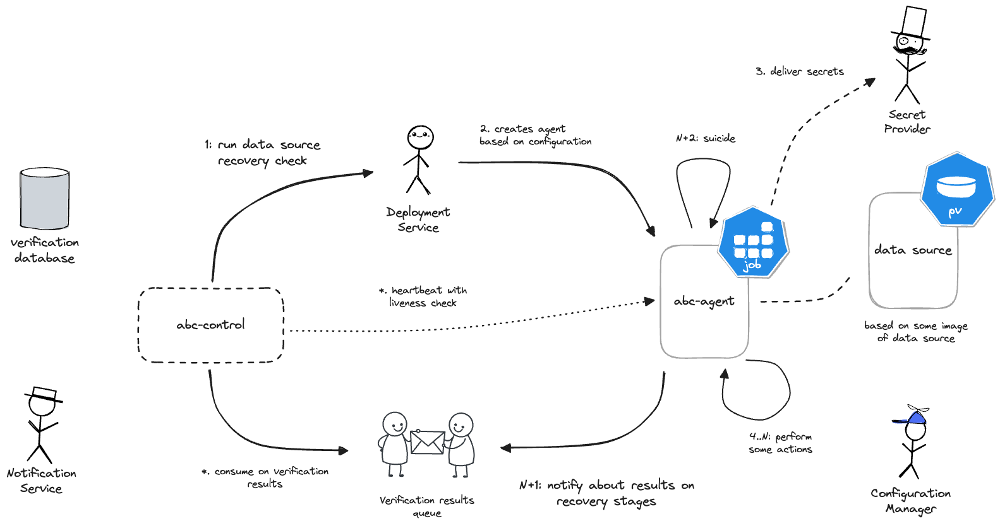
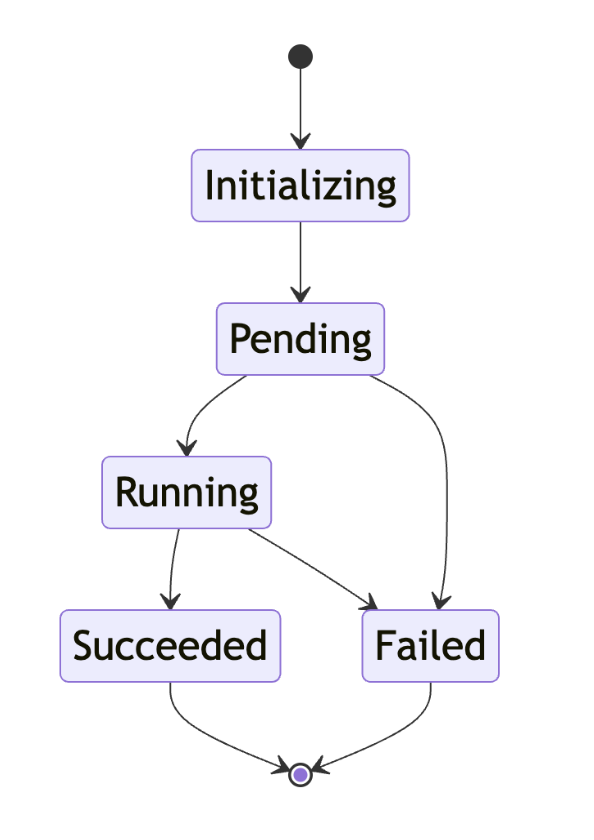
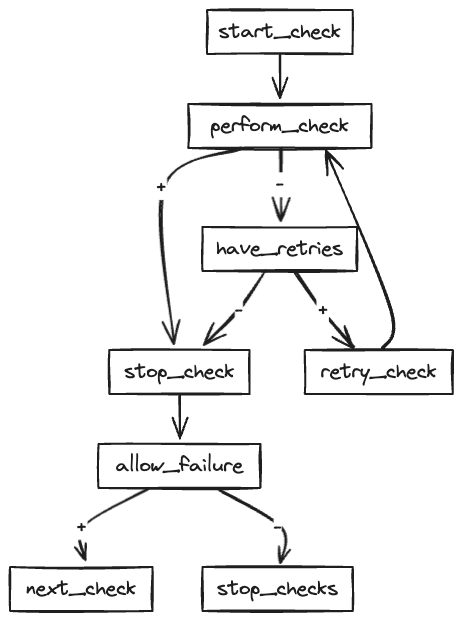

## Платформа проверки бэкапов

Платформа проверки бекапов представляет собой инструмент для выявления и устранения некорректных резервных копий
данных, включая, но не ограничиваясь, базами данных.

Платформа разработана с целью обеспечения надежности и целостности данных, а также минимизации рисков,
связанных с потерей информации в результате восстановления из некорректных резервных копий.

Автоматическая проверка бекапов, производимая платформой, позволяет выявить некорректные экземпляры на самых ранних
этапах и сообщить об этом ответственным лицам.

## Роль агента на платформе

Агент - это программное обеспечение, которое осуществляет непосредственную проверку данных в соответствии с переданной
конфигурацией и возвращает результаты обратно в управляющую систему платформы.

Агенты поднимаются для выполнения проверок и завершают свою работу после завершения, а управление ими и обработка
передаваемых данных осуществляется в control plane.



## Функциональные требования к агенту

- Способность выполнения проверок, указанных в конфигурации.
- Возврат результатов проверки обратно в управляющую систему.
- Предоставление статуса живучести во время выполнения проверок.
- Возможность прервать работу досрочно без потери результатов.

## Нефункциональные требования к агенту

- Запуск в любой среде, включая контейнеры.
- Независимость выполнения проверок от типа данных.
- Полное абстрагирование от запускаемых команд.
- Обеспечение должного уровня observability для отслеживания проблем.

## Статусная модель агентов

Концепция статусной модели агентов представляет собой последовательность состояний, в которых находятся агенты в
процессе выполнения проверок резервных копий. Эти состояния необходимы для наблюдения за работой агентов и принятия
решений на основе данных о выполнении проверок.



- Инициализация (Initializing): Агент готовится к выполнению проверок после получения запроса на проверку и обработки
  его в control plane. Здесь может создаваться конфигурации агента по необходимости.
- Ожидание (Pending): Агент находится в процессе развёртывания, и пока не известно, завершилось ли его создание успешно.
- Выполнение (Running): Агент успешно запущен и активно выполняет переданные проверки.
- Успешное завершение (Succeeded): Агент успешно завершил проверки и передал результаты обратно в систему.
- Неудачное завершение (Failed): Агент завершил проверки с ошибкой и передал об этом информацию обратно в систему.

Эта модель позволяет чётко определить текущее состояние агента в процессе выполнения проверок и принимать
соответствующие действия на основе этой информации.

## Диаграмма активности выполнения проверок

В процессе верификации мы имеем два типа проверок: системные и пользовательские.

Пользовательские проверки - это логические команды, направленные, например, на проверку наличия определенных данных в
базе данных.

Системные проверки, в свою очередь, зависят от типа данных, которые мы проверяем. Например, для баз данных это может
быть корректность развертывания, наличие определенных файлов и т.д.

Некоторые проверки могут завершаться неуспешно, чтобы выявить все проблемы с данными сразу. Однако, основная проверка
развертывания не может завершиться неуспешно, так как от нее зависит результат всех остальных.

Для управления неуспешными проверками у нас есть механизм ретраев, который позволяет агенту повторить проверку
несколько раз, прежде чем считать ее неудачной.

```yaml
datasource_name: dbaas-postgresql
metadata:
  version: 1
recovery_tool:
  environment:
    AWS_REGION: "us-east-1"
    AWS_S3_FORCE_PATH_STYLE: "true"
    AWS_ACCESS_KEY: "{{ .CEPH_ACCESS_KEY }}"
    AWS_SECRET_KEY: "{{ .CEPH_SECRET_KEY }}"
    AWS_ENDPOINT: "{{ .CEPH_ENDPOINT }}"
    WALG_S3_PREFIX: "s3://{{ .BUCKET_NAME }}"
  checks:
    - name: _base
      command:
        - /etc/abc-agent/perform_checks.sh
        - /etc/abc-agent/verify_results.sh
    - name: have_user_table
      command:
        - |
          have_user_table() {
            psql -U postgres -d dbaas -c "SELECT 1 FROM pg_tables WHERE tablename = 'users';" | grep -q 1
          }
          
          [ "$(have_user_table)" = "1" ] || exit 1
      max_retries: 3
    - name: disabled_check
      command:
        - exit 1
      disabled: true
```

Проверки могут описываться различными способами: bash-script, executable binary - главное, чтобы файл был исполняемым и
был доступен в образе агента.

Диаграмма активности, используемая в момент выполнения проверок, представлена ниже:



[//]: # (```mermaid)
[//]: # (graph TD;)
[//]: # (    start_check --> perform_check;)
[//]: # (    perform_check -->|+| stop_check;)
[//]: # (    perform_check -->|-| have_retries;)
[//]: # (    have_retries -->|+| retry_check;)
[//]: # (    have_retries -->|-| stop_check;)
[//]: # (    retry_check --> perform_check;)
[//]: # (    stop_check --> allow_failure;)
[//]: # (    allow_failure -->|+| next_check;)
[//]: # (    allow_failure -->|-| stop_checks;)
[//]: # (```)
