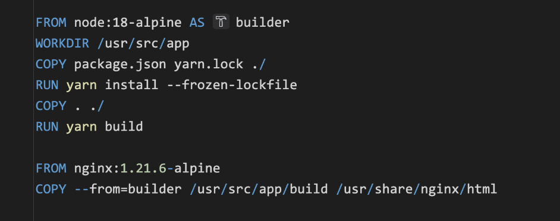

## Анализ требований:

### Цель проекта:

- Разработать автоматизированный процесс деплоя фронтенда для команды SDP.
- Ускорить и упростить процесс развертывания новых версий фронтенда.
- Обеспечить надежность и стабильность деплоя.

### Функциональные требования:

- Поддержка различных окружений: стейджинг, продакшн.
- Автоматическое обнаружение новых версий фронтенда при создании тега в репозитории Git.
- Проверка наличия всех необходимых зависимостей и ресурсов перед деплоем.
- Публикация образов приложения в Artifactory для хранения и управления версиями образов.
- Использование Helm для деплоя фронтенда в Kubernetes.
- Управление версиями и возможность отката к предыдущим версиям.
- Мониторинг и журналирование процесса деплоя.

### Нефункциональные требования:

- Безопасность: защита конфиденциальных данных, использование шифрования при передаче данных, контроль доступа к системе
  деплоя.
- Масштабируемость: способность обрабатывать деплой большого числа фронтендов в параллель.
- Надежность: обеспечение стабильной работы и восстановление после сбоев.
- Производительность: минимальное время деплоя, оптимальное использование ресурсов.
- Удобство использования: интуитивный интерфейс, простота конфигурации и настройки.

## Обучение технологиям:

Изучение технологий таких как, Kubernetes, Helm и Istio обусловлено необходимостью освоения современных инструментов
управления и развертывания приложений в микросервисной архитектуре. Мое предшествующее незнание стало причиной данного
обучения.

Системы, вроде Kubernetes, сложны и требуют времени для полного освоения. Но их основ вполне достаточно для достижения
целей, поставленных в задаче. Для глубокого понимания и полного овладения ими потребуется больше времени и практики.

Сложность системы, необходимость практического опыта и ее постоянное развитие являются основными причинами, почему
такие технологии не могут быть полностью освоены за короткий промежуток времени.

### Kubernetes

_Kubernetes – это программная система, которая позволяет нам быстро развертывать контейнерные приложения и управлять ими
поверх нее._ Он опирается на функции контейнеров Linux для запуска разнородных приложений без необходимости знать
какие-либо внутренние детали этих приложений и без необходимости вручную развертывать эти приложения на каждом хосте.

Поскольку эти приложения работают в контейнерах, они не влияют на другие приложения, работающие на том же сервере, что
очень важно, когда мы запускаем приложения для совершенно разных проектов на одном и том же оборудовании.

Kubernetes позволяет нам запускать свои приложения на тысячах компьютерных узлов, как если бы все эти узлы были одним
огромным компьютером. Он абстрагирует базовую инфраструктуру и тем самым упрощает разработку, развертывание и управление
как для групп разработки, так и для групп эксплуатации.

#### Архитектура кластера Kubernetes

На аппаратном уровне кластер k8s состоит из множества узлов, которые можно разделить на два типа:

- **Master node** (Control Plane) – контролирует и управляет всей системой
- **Worker node** – запускает реальные приложения

Master состоит из нескольких компонентов, которые могут работать на одном главном узле или быть разделены на несколько
узлов и реплицированы для обеспечения высокой доступности.

- **API Server** – компонента через которое происходит общение пользователя и других компонент Control Plane.
- **Scheduler** – назначает рабочий узел для каждого развертываемого компонента нашего приложения и по необходимости
  оптимизирует их расположение.
- **Controller manager** – выполняет функции уровня кластера, такие как репликация, отслеживание рабочих узлов и
  обработка сбоев самих узлов.
- **etcd** – распределенное хранилище ключей и значений, в котором хранится состояние кластера (данные конфигурации).

Компоненты Control Plane хранят и контролируют состояние кластера, но не запускают наши приложения. Это делается
рабочими узлами.

_Рабочие узлы – это машины, на которых выполняются наши контейнерные приложения._

Задача запуска, мониторинга и предоставления услуг приложениям выполняется следующими компонентами:

- **Container runtime** (docker) – отвечает за запуск контейнеров.
- **kubelet** – общается с API сервером и управляет контейнерами на его узле.
- **kube-proxy** – отвечает за балансировку нагрузки сетевого трафика между компонентами приложения.

#### Основные объекты Kubernetes

С архитектурой кластера закончили, перейдем к основным объектам кластера, которые используются в процессе выполнения
практической работы.

##### Pods

Kubernetes не запускает контейнеры напрямую; вместо этого он оборачивает один или несколько контейнеров в структуру
более высокого уровня, называемую _pod_. Все контейнеры в одном модуле будут использовать одни и те же ресурсы и
локальную
сеть. Контейнеры могут легко взаимодействовать с другими контейнерами в одном модуле, как если бы они находились на
одном компьютере, сохраняя при этом определенную степень изоляции от других.

Поды могут содержать несколько контейнеров, но мы должны ограничивать себя, когда это возможно.

##### Deployments

Хотя поды являются базовой единицей вычислений в Kubernetes, они обычно не запускаются напрямую в кластере. Вместо этого
модули обычно управляются еще одним уровнем абстракции: _deployment_.

Основная цель – объявить, сколько реплик пода должно работать одновременно. При добавлении в кластер, деплоймент
автоматически запускает запрошенное количество подов, а затем отслеживает их. Если под умирает, то он автоматически
воссоздастся при помощи деплоймента.

##### Services

Сеть подов в кластере – неплохой материал, но сам по себе он недостаточен для создания долгосрочных систем, поскольку
поды в Kubernetes эфемерны. В качестве конечной точки можно использовать IP-адрес пода, но нет гарантии, что при
следующем воссоздании пода адрес останется прежним. Его смена может произойти по любой причине.

Встречаем, _сервис – это абстрактный объект, который определяет логический набор подов и политику доступа к ним_.
Сервисы создают слабую связь между подами, которые от них зависят. Как правило, набор подов для сервиса определяется
через специальные селекторы, которые в свою очередь смотрят на метки подов.

##### Ingress, Ingress Controller

_Ingress - это объект в Kubernetes, который определяет правила маршрутизации HTTP и HTTPS трафика на сервисы внутри
кластера._

Он действует как управляемый маршрутизатор, который позволяет настраивать виртуальные хосты, маршруты, SSL-сертификаты и
другие параметры для обработки входящих запросов и их направления к соответствующим сервисам.

Ingress Controller может быть внешним или встроенным в Kubernetes. Внешний Ingress Controller, такой как NGINX Ingress
Controller или Traefik, является отдельным компонентом, который устанавливается и настраивается отдельно от Kubernetes.
Он прослушивает входящий трафик на определенных портах и маршрутизирует его внутри кластера в соответствии с настройками
Ingress.

Общая концепция заключается в том, что Ingress определяет правила маршрутизации, а Ingress Controller обрабатывает их и
направляет трафик внутри кластера. Это позволяет управлять внешним доступом к сервисам Kubernetes и обеспечивает более
гибкую и масштабируемую архитектуру приложений.

##### Config map

_ConfigMap – это объект в Kubernetes, который используется для хранения конфигурационных данных, таких как переменные
среды, параметры конфигурации или любые другие текстовые данные._

Предоставляет способ разделения конфигурации приложений от самих приложений, что облегчает их управление и обновление
без необходимости изменения исходного кода.

ConfigMap может быть связан с подом через механизмы ссылок на переменные среды или монтирования файлов. При
использовании переменных среды, значения будут доступны внутри контейнера как переменные окружения. При монтировании
ConfigMap в файл, значения будут доступны внутри файловой системы контейнера.

### kubectl, helm

_kubectl (Kube Control) - это CLI утилита для управления кластером Kubernetes._

Она является основным инструментом для взаимодействия с Kubernetes API и выполнения операций на кластере. С помощью
kubectl можно управлять ресурсами Kubernetes, такими как Pod, Deployment, Service, ConfigMap и другими.

_Helm - это пакетный менеджер для Kubernetes, который облегчает установку, обновление и управление приложениями в
кластере._

Он предоставляет стандартизированный способ упаковки приложений и их зависимостей в виде "чартов" (charts), которые
могут быть установлены и управляемы через командную строку.

#### Ключевые понятия и возможности Helm

- **Чарты**: пакет, который содержит все ресурсы и зависимости для развертывания приложения в Kubernetes. Он включает в
  себя
  файлы манифестов Kubernetes, шаблоны, переменные и другие ресурсы, необходимые для развертывания приложения.
- **Репозитории**: Helm поддерживает установку чартов из удаленных репозиториев, которые могут быть общедоступными или
  частными. Репозитории содержат наборы чартов и обновляются для предоставления новых версий и обновлений.
- **Helm CLI**: Предоставляет набор команд для управления установкой, обновлением и удалением чартов. С помощью Helm CLI
  можно
  устанавливать чарты из удаленных репозиториев, а также создавать собственные репозитории для распространения чартов.
- **Управление зависимостями**: Helm позволяет определять зависимости в чарте, что позволяет управлять зависимыми
  компонентами
  и устанавливать их автоматически. Это особенно полезно, когда приложение требует другие сервисы или ресурсы для своего
  функционирования.
- **Управление версиями и обновления**: Helm предоставляет возможность управления версиями установленных чартов. Это
  позволяет
  отслеживать историю изменений, откатываться к предыдущим версиям и обновлять установленные чарты до новых версий с
  помощью простых команд.

### Istio

_Istio - это платформа для управления сетевым трафиком и службами в среде Kubernetes._ Предоставляет возможности
маршрутизации, балансировки нагрузки, обнаружения и контроля служб, управления безопасностью и мониторинга в
распределенных микросервисных приложениях.

В мире без Istio один сервис делает прямые запросы к другому, а в случае сбоя сервис должен сам обработать его:
предпринять новую попытку, предусмотреть таймаут, открыть circuit breaker и т.п.

Istio же предлагает специализированное решение, полностью отделённое от сервисов и функционирующее путём вмешательства в
сетевое взаимодействие. И таким образом оно реализует: отказоустойчивость, канареечные выкаты, мониторинг и метрики,
трассировка и наблюдаемость, безопасность.

## Диаграмма системной архитектуры

### Компоненты основного процесса

#### Git и GitLab

Git является основным хранилищем исходного кода проекта. Разработчики выполняют операции коммита и отправки изменений в
Git-репозиторий. GitLab CI/CD Server слушает события Git и реагирует на изменения в репозитории, запуская пайплайны
CI/CD для сборки, тестирования и развертывания.

#### GitLab CI/CD Server и Build Agent

GitLab CI/CD Server отправляет команды на Build Agent для выполнения операций сборки, тестирования и упаковки
приложения. Build Agent - это машина или виртуальная машина, на которой выполняются задачи сборки и тестирования на
основе инструкций от GitLab CI/CD Server.

#### Build Agent и Artifactory

После успешного выполнения сборки и тестирования, Build Agent сохраняет сгенерированные артефакты, такие как Docker
образы, в Artifactory - систему управления артефактами. Artifactory предоставляет централизованное хранение артефактов и
управление их версиями.

#### Artifactory и Kubernetes

При необходимости развертывания приложения используется Artifactory для доступа к Docker образам, необходимым для
развертывания.

#### Kubernetes и Target Environment

Kubernetes управляет развертыванием и оркестрацией приложений в Target Environment. Target Environment представляет
собой целевую среду, в которой приложение развертывается и выполняется, такую как тестовая среда, стейджинговая среда
или производственная среда.

## Разработка CI/CD пайплайнов

Первое о чем стоит задуматься это, то как нам описать процесс сборки образа нашего приложения.

### Dockerfile

Встречаем Dockerfile – текстовый файл, который содержит инструкции для сборки Docker-образа. Он определяет, какой
базовый образ использовать, как скопировать файлы в образ, как установить зависимости, как настроить окружение и многое
другое.

Приведенный код Dockerfile представляет multistage сборку для приложения на основе фреймворка React.

- Первый этап (build) использует node.js образ, устанавливает зависимости, копирует все файлы из текущего контекста
  сборки, выполняет сборку приложения с помощью команды yarn build. Создает собранные статические файлы в папке build.
- Второй этап (nginx) использует легковесный образ Nginx, копирует собранные статические файлы из первого этапа внутрь
  контейнера, что позволяет использовать nginx для обслуживания статических файлов нашего React-приложения.

Как собирать образ знаем, теперь можем приступать с пайплайнам.

### GitLab CI

Файл _.gitlab-ci.yml_ - это конфигурационный файл для GitLab CI/CD, который определяет шаги и настройки для
автоматической сборки, тестирования и развертывания вашего проекта.

Для простоты использования файл разбит на несколько файлов, каждый из которых отвечает за свою задачу. Так же следует
пробежаться по директориям, они называны не случайно:

- **/ci** – содержит в себе конфигурационные файлы ответственные за сборку приложения, а так же его образа
- **/cd** – содержит в себе конфигурационные файлы ответственные за деплой приложения

Поддириктории так же названы по специальному принципу, /steps и /templates. Первый представляет в неком роде кусочки,
интерфейсы пайплайнов, которые в свою очередь используются в templates. Это позволяет не повторять самих себя и мыслить
в рамках определенных подзадач, выполняемых джобом.

Хранит этапы, отвечающие за прогонку линтеров и юнит-тестов.
Наследуется от джобы **.setup-node**, которая скачивает все необходимые зависимости.

Отвечает за сборку образов фронтенда, наследуется от джобы **.kaniko-build**, которая использует kaniko executor для
сборки и последующей публикации в artifactory.

Отвечает за деплой в зависимости от окружения, наследуется от **.k8s-deploy** джобы.

**.k8s-deploy** сначала производит конфигурацию для выкачивания образа приложения из artifactory, затем происходит
конфигурация для доступа в кластер и последующий деплой с апгрейдом версии чарта.

### k8s

Скриншоты для объектов не будут приведены, используемые компоненты:

- Deployment
- Service
- ConfigMap (для nginx)
- Certificate (генерация ssl сертификата для приложения)
- Istio Gateway
- Istio VirtualService

Вместо Ingress используем связку Gateway, Virtual Service.

Gateway настраивает порт, протоколы и выполняет маршрутизацию виртуального хоста, который с помощью Virtual Service
направляет трафик к фактическому микросервису.

## Тестирование

### Тестирование на уровне кода

Про автоматизацию тестирования в рамках CI/CD конвейера для нашего фронтенд-приложения уже было упомянуту ранее.

Процесс тестирования начинается с этапа сборки, где мы устанавливаем зависимости. После этапа сборки, мы запускаются
юнит-тесты. Разработчики написали основной набор юнит-тестов, покрывающих различные компоненты и функциональности нашего
приложения. Эти тесты выполняются автоматически при каждом изменении кода. Результаты тестов можно увидеть в логах
джобы, внедрение специальных библиотек по сбору метрик с тестов пока не предусмотрено.

Благодаря автоматизации тестирования в рамках нашего CI/CD конвейера, мы сокращаем время и усилия, затрачиваемые на
ручное тестирование. Команда получает надежную обратную связь о качестве кода и оперативно реагирует на возможные
проблемы. Это улучшает нашу способность доставлять качественное программное обеспечение в кратчайшие сроки.

### Тестирование при развертывании приложения

При деплое приложения в Kubernetes активно проводилось тестирование, чтобы убедиться в корректности и успешном
развертывании нашего приложения в кластере. Перед началом деплоя было подготовлено тестовое окружение.

Тестирование включало следующие шаги:

- **Проверка конфигурации:** внимательная проверка конфигурационные файлы, таких как манифесты Kubernetes и Helm чарты,
  чтобы убедиться, что они содержат правильные параметры и настройки и не выставляют никакие секреты наружу.

- **Развертывание приложения:** тестирование развертывания нашего приложения в кластере, следя за процессом и проверяя,
  что развертывание прошло успешно и все ресурсы были созданы и настроены правильно.

- **Масштабирование и автомасштабирование:** возможность масштабирования нашего приложения, чтобы убедиться, что
  приложение может обрабатывать увеличение нагрузки и адаптироваться к изменяющимся условиям.

- **Откат и обновление:** возможность отката и обновления приложения, чтобы убедиться, что мы можем безопасно
  возвращаться к предыдущим версиям или выполнять обновления без прерывания работы приложения.

В процессе ручного тестирования я активно взаимодействовал с Kubernetes API, использовали инструменты командной строки,
такие как kubectl и helm, и наблюдал за состоянием и журналами приложений в кластере.

Ручное тестирование в процессе деплоя на тестовое окружение - важный шаг, чтобы убедиться, что приложение правильно
работает в данной среде и соответствует ожиданиям. Это также дало возможность проверить конфигурацию и процессы
развертывания, а также обнаружить и исправить возможные проблемы до продакшн-среды.

## Внедрение и мониторинг

Для сбора и хранения метрик используется Prometheus.

### Собираемые метрики

В процессе мониторинга мы собираем следующие метрики:

- **Server Response Time**: измеряет время, требуемое для обработки и отправки ответа от сервера Nginx.

- **Server Load**: отслеживает нагрузку на сервер, включая использование CPU, памяти и сети.

- **HTTP Status Codes**: регистрирует коды состояния HTTP, такие как успешные ответы, ошибки и другие.

- **Количество запросов к серверу**: отображает количество запросов, полученных и обработанных сервером Nginx.

### Анализ собранных метрик

Собранные метрики помогают оценить производительность, доступность и использование ресурсов нашего React приложения,
поставляемого через Nginx.

- Анализ времени ответа сервера позволяет определить, как быстро сервер Nginx обрабатывает запросы и отправляет ответы
  клиентам.

- Мониторинг нагрузки на сервер помогает выявить, когда сервер подвергается высокой нагрузке, и принять меры для
  масштабирования ресурсов или оптимизации производительности.

- Регистрация HTTP кодов состояния позволяет отслеживать успешные запросы, ошибки или другие проблемы, возникающие при
  обработке запросов.

- Мониторинг количества запросов к серверу позволяет оценить объем трафика, получаемого вашим приложением, и выявить
  аномалии или пиковые нагрузки.

Анализ и интерпретация этих метрик помогут вам оценить работу вашей системы, выявить возможные проблемы или
bottleneck, и предпринять необходимые шаги для улучшения производительности и доступности.

## Выводы

Реализация позволит значительно ускорить и упростить процесс развертывания новых версий фронтенда, что приведет к
повышению эффективности работы команды и сокращению возможных ошибок, связанных с ручным развертыванием. Надежность и
стабильность деплоя будут обеспечены благодаря консистентным и повторяемым шагам развертывания, а также использованию
механизмов проверки целостности и качества кода, автоматических тестов и мониторинга.

Внедрение современных инструментов и практик, таких как контейнеризация и оркестрация, поможет создать масштабируемую и
отказоустойчивую инфраструктуру, обеспечивающую непрерывную работу приложения даже при высокой нагрузке.

Важно поддерживать обратную связь с командой и внедрять их предложения для дальнейшего совершенствования процесса
развертывания. 

