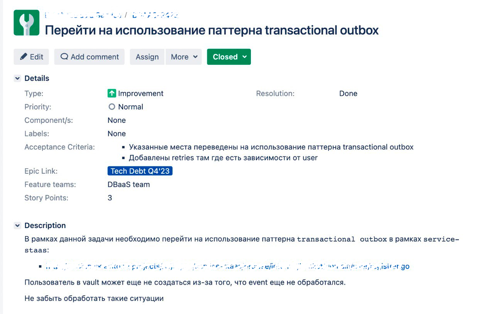
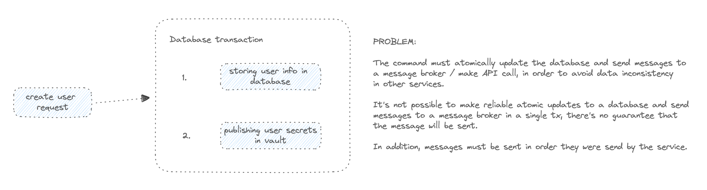
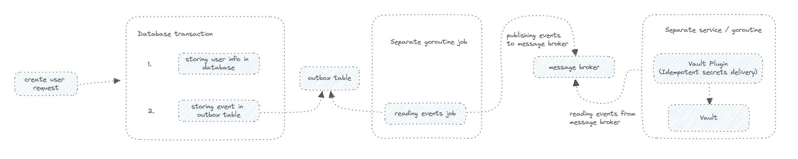

## Контекст

Объектное хранилище ([object storage](https://cloud.google.com/learn/what-is-object-storage)) представляет собой
архитектуру компьютерного хранения данных, спроектированную для обработки больших объемов неструктурированных данных.

В отличие от других архитектур, оно определяет данные как отдельные единицы, снабженные метаданными и уникальным
идентификатором, который можно использовать для поиска и доступа к каждой единице данных.

Примером таких данных могут быть фотографии, видео, документы, музыка, архивы, бекапы и т.д.

STaaS (Storage as a Service) - это платформа, задачей которой является предоставление пользователям доступа к
объектному хранилищу, без необходимости задумываться о его поддержке и обслуживании, а также о различных
деталях реализации.

Взаимодействие с платформой происходит посредством REST API, сама же платформа
использует [S3 протокол](https://docs.aws.amazon.com/s3/) для работы с бакетами.

> Бакет это логическое хранилище, которое используется для хранения объектов.

## Техническое задание



Для самой задачи достаточно погрузиться только в часть, отвечающую за регистрацию пользователя.

После регистрации пользователь может быть указан в списке `userAccessList` конкретного бакета, что позволит ему
взаимодействовать.

> Стоит отметить, что "пользователем" помимо реального человека, может быть и другой сервис.

## Архитектура

Архитектурные решения при построении самого STaaS не будут рассматриваться, так как это выходит за рамки задачи.

Для понимания достаточно знать, что используется [Ceph](https://ceph.io/en/) для хранения данных, а
также [Vault](https://www.vaultproject.io/) для хранения секретов.
Для большей безопасности при доставке секретов в Vault
используются [Vault Plugins](https://www.vaultproject.io/docs/internals/plugins)

На первый взгляд, задача кажется тривиальной, но на самом деле все не так просто.

В прошлой реализации, при регистрации пользователя, происходило создание пользователя в базе данных, а также
публикация секретов в Vault в рамках одной транзакции БД.

Проблема в том, что обновление в базе данных и вызов Vault API / публикация событий в message broker, должно
происходить атомарно, чтобы избежать несогласованности данных.

В случае сетевых проблем, сбоев или истечения транзакции, данные могут оказаться в несогласованном состоянии -
гарантии отсутствуют.



Для решения этой проблемы, был предложен подход с
использованием [Transactional Outbox](https://microservices.io/patterns/data/transactional-outbox.html).

В рамках этого подхода, при регистрации пользователя, происходит создание записи в таблице `outbox`, которая
содержит в себе информацию о том, что необходимо доставить секреты в Vault.

Отдельная горутина (поток) периодически достает необработанные записи из таблицы `outbox` и публикует события в message
broker из которого потом вычитываются события и происходит доставка секретов в Vault.
Публикация секретов должна происходить идемпотентно, то есть повторное выполнение операции не должно приводить к
изменению состояния.

Так же стоит отметить, что секреты доставляются в двух экземплярах, чтобы бесшовно подменить одни секреты другими,
в случае необходимости.



## Псевдокод

Псевдокод для прошлой версии:

```go
type userService struct {
	userRepo         repository.User
	secretsGenerator secrets.Generator

	// wrapper around vault client, done for returning
	// secrets if they are already generated
	secretsProvider secrets.Provider
}

// model/user.go
type User struct {
	ID               string `json:"id"`
	Name             string `json:"name"`
	VaultSecretsPath string `json:"vault_secrets_path"`
}

// previous version of code without of usage outbox pattern
func (us *userService) registerUser(ctx context.Context, user *model.User) error {
	return us.userRepo.RunTx(ctx, func(ctx context.Context) error {
		if err := us.userRepo.Create(ctx, user); err != nil {
			return fmt.Errorf("failed to create user: %w", err)
		}

		secrets, err := us.secretsGenerator.Generate(ctx)
		if err != nil {
			return fmt.Errorf("failed to generate secrets: %w", err)
		}

		if err = us.secretsProvider.WriteSecrets(ctx, user.VaultSecretsPath, secrets); err != nil {
			return fmt.Errorf("failed to write secrets: %w", err)
		}

		return nil
	})
}
```

Псевдокод для новой версии:

```go
type userOutboxWorker struct {
	outbox          repository.Outbox
	period          time.Duration
	eventsBatchSize int
}

// run launches worker in separate goroutine, which periodically
// reads events from outbox table and publishes them to message broker.
func (w *userOutboxWorker) run(ctx context.Context) error {
	for {
		select {
		case <-ctx.Done():
			return nil
		case <-time.After(w.period):
			if err := w.processOutbox(ctx); err != nil {
				return fmt.Errorf("failed to process outbox: %w", err)
			}
		}
	}
}

func (w *userOutboxWorker) processOutbox(ctx context.Context) error {
	events, err := w.outbox.GetEvents(ctx, w.eventsBatchSize)
	if err != nil {
		return fmt.Errorf("failed to get events: %w", err)
	}

	// as an example, in real world it's harder, probably pushed
	// to some message broker
	for _, event := range events {
		if err := w.processEvent(ctx, event); err != nil {
			return fmt.Errorf("failed to process event: %w", err)
		}
	}

	return nil
}

// event.UserCreated
type UserCreated struct {
	UserID         string    `json:"user_id"`
	EventID        string    `json:"event_id"`
	EventCreatedAt time.Time `json:"event_created_at"`
}

// new version of code with usage outbox pattern
func (us *userService) registerUserV2(ctx context.Context, user *model.User) error {
	return us.userRepo.RunTx(ctx, func(ctx context.Context) error {
		if err := us.userRepo.Create(ctx, user); err != nil {
			return fmt.Errorf("failed to create user: %w", err)
		}

		// storing userCreated event in outbox table
		if err := us.userRepo.NotifyUserCreated(ctx, &event.UserCreated{
			UserID:         user.ID,
			EventID:        uuid.New().String(),
			EventCreatedAt: time.Now(),
		}); err != nil {
			return fmt.Errorf("failed to notify user created: %w", err)
		}

		return nil
	})
}

type userEventsProcessor struct {
	userRepo         repository.User
	secretsGenerator secrets.Generator
	secretsProvider  secrets.Provider
}

// provideUserSecrets is called after reading the event from message broker.
func (p *userEventsProcessor) provideUserSecrets(ctx context.Context, e *event.UserCreated) error {
	user, err := p.userRepo.GetUserByID(ctx, e.UserID)
	if err != nil {
		return fmt.Errorf("failed to get user by id: %w", err)
	}

	secrets, err := p.secretsGenerator.Generate(ctx)
	if err != nil {
		return fmt.Errorf("failed to generate secrets: %w", err)
	}

	if err = p.secretsProvider.WriteSecrets(ctx, user.VaultSecretsPath, secrets); err != nil {
		return fmt.Errorf("failed to write secrets: %w", err)
	}

	return nil
}
```

Описанные выше методы покрываются юнит тестами, а также пишутся интеграционные тесты для проверки корректности
доставки секретов в Vault и срабатыванию логики плагина.

## Деплой

В момент релиза происходит:

- создание топиков для чтения событий о регистрации пользователей
- деплой Vault плагина для идемпотентной доставки (регистрируется на определенный префикс в пути секретов)
- деплой STaaS (Docker контейнеры, Kubernetes все дела)
