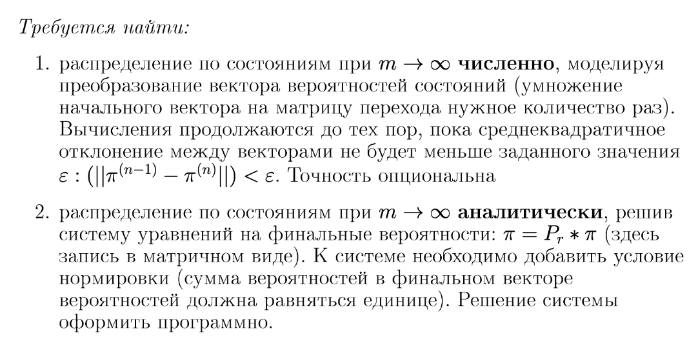
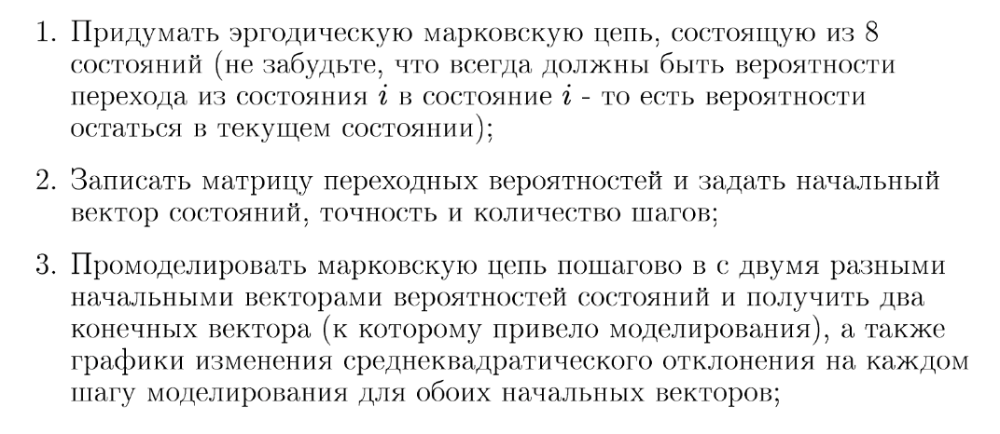
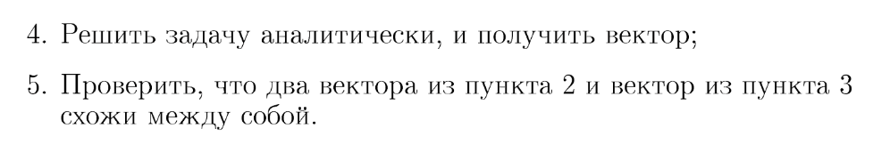
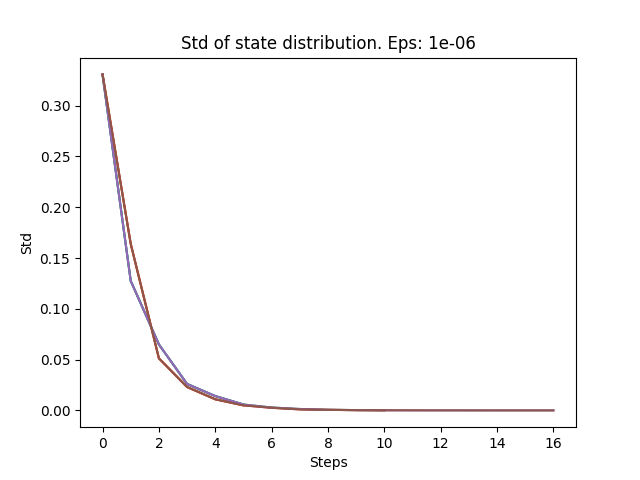

### Задание







### Ход работы

Реализуем два метода соответственно:

- Для численного метода:
    ```python
    def state_dist_numeric(
        chain: np.ndarray[np.ndarray[float]],
        initial_state: np.ndarray[float],
        eps: float = 1e-6,
        steps: int = 1000,
    ) -> np.ndarray[float]:
        std = np.std(initial_state)
        while steps > 0:
            initial_state = np.matmul(initial_state, chain)
            cur_std = np.std(initial_state)
            if np.abs(std - cur_std) < eps:
                break
    
            std = cur_std
            steps -= 1
    
        return initial_state
    ```
  Производит вычисления при помощи преобразований вектора вероятности состояний.

  Преобразование происходит путем
  умножения на матрицу перехода до тех пор, пока не будет достигнута точность `eps` или не будет пройдено `steps`
  итераций


- Для аналитического метода:
  ```python
  def state_dist_analytic(
      chain: np.ndarray[np.ndarray[float]],
  ):
      chain = chain - np.eye(chain.shape[0])
      chain[-1] = np.ones(chain.shape[0])
      b = np.zeros(chain.shape[0])
      b[-1] = 1
      return np.linalg.solve(chain, b)
  ```

Решаем систему уравнений `pi = P * pi` методом Гаусса и находим стационарные вероятности состояний.

### Результаты

Имеем эргодическую цепь с матрицей перехода:

```markdown
[[0.2, 0,   0.4,  0.1,  0,   0,   0.15, 0.15]
 [0,   0.1, 0,    0.2,  0.5, 0,   0.2,  0]
 [0.1, 0,   0.1,  0,    0,   0.4, 0.3,  0.1]
 [0,   0.1, 0,    0.3,  0,   0,   0.3,  0.3]
 [0.4, 0,   0.2,  0.2,  0.1, 0.1, 0,    0]
 [0,   0.3, 0.15, 0,    0.4, 0.1, 0,    0.05]
 [0.1, 0.2, 0.05, 0.1,  0,   0.2, 0.05, 0.3]
 [0.2, 0.3, 0.1,  0.1,  0,   0.2, 0,    0.1]]
```

Возмем первоначальные векторы для численного метода:

```markdown
[1, 0, 0, 0, 0, 0, 0, 0]
[0, 1, 0, 0, 0, 0, 0, 0]
```

Получим вот такой результат:

```text
State distribution after 5 steps: [0.132 0.119 0.127 0.129 0.134 0.12  0.122 0.118], for initial state: [1. 0. 0. 0. 0. 0. 0. 0.]
State distribution after 5 steps: [0.118 0.134 0.121 0.122 0.13  0.127 0.122 0.127], for initial state: [0. 1. 0. 0. 0. 0. 0. 0.]
State distribution after 10 steps: [0.125 0.125 0.125 0.125 0.125 0.125 0.125 0.125], for initial state: [1. 0. 0. 0. 0. 0. 0. 0.]
State distribution after 10 steps: [0.125 0.125 0.125 0.125 0.125 0.125 0.125 0.125], for initial state: [0. 1. 0. 0. 0. 0. 0. 0.]
State distribution after 50 steps: [0.125 0.125 0.125 0.125 0.125 0.125 0.125 0.125], for initial state: [1. 0. 0. 0. 0. 0. 0. 0.]
State distribution after 50 steps: [0.125 0.125 0.125 0.125 0.125 0.125 0.125 0.125], for initial state: [0. 1. 0. 0. 0. 0. 0. 0.]
```

Посмотрим, как менялось отклонение от стационарного распределения:



Происходит экспоненциальное убывание отклонения от стационарного распределения.

### Выводы

- Были изучены и реализованы численный и аналитический методы вычисления стационарного распределения для эргодических
  цепей.