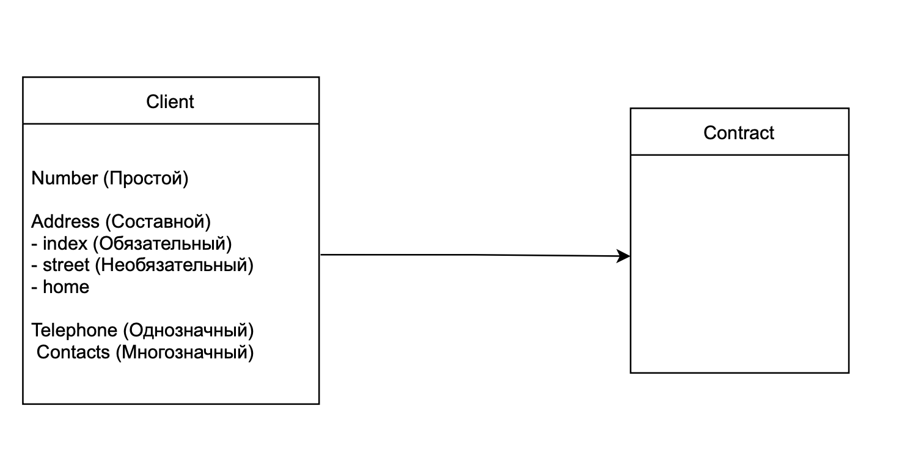
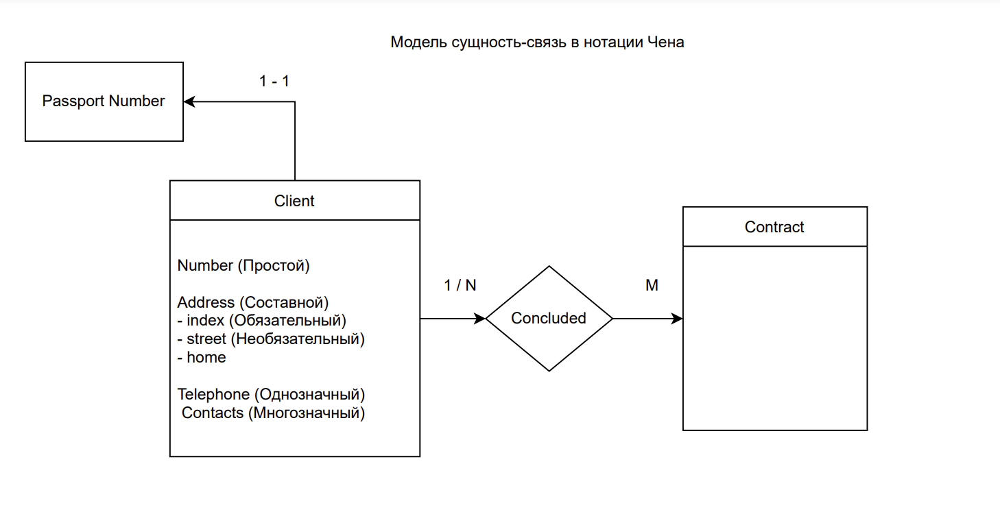
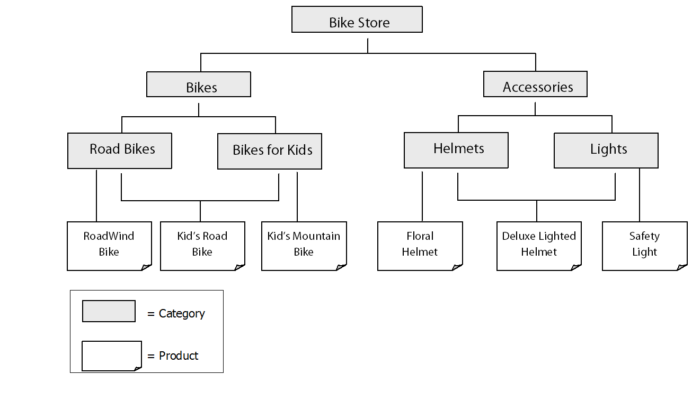
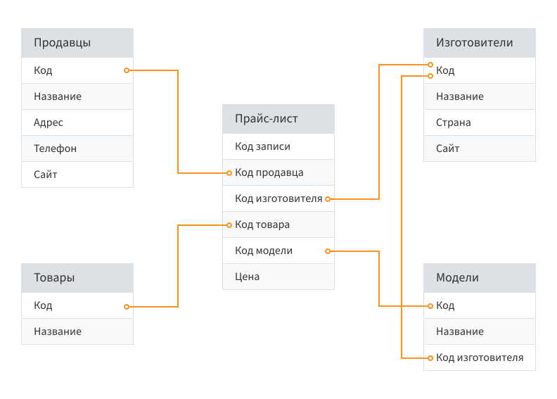

# Databases

## Contents
- [Lecture #1](#lecture-1)
- [Lecture #2](#lecture-2)
- [Lecture #3](#lecture-3)

## Lecture #1

Информация как:

- данные 
- сигнал (не надо знать что именно)
- знания (применение, создание)

Данные - поддающиеся многократные интерпретации, представление информации в **формализованном виде** пригодных для передачи, интерпретации или обработки.

Студент А учится в группе Х  
Преподаватель B читает в группе X

Данные позволяют строить интерпретации.

**I**

| Студент | Группа | Дисциплина | Преподаватель |
| --- 	| --- 	| --- 	| --- |

- Много строчек = \1 * \2 * \3 * \4
- Трудно обеспечимая целостность данных
- Медленный поиск
- Данные неуникальны

**II**

| Студент | Группа | Преподаватель дисциплины 1 | Преподаватель дисциплины N |
| --- 	| --- 	| --- 	| --- |

- Количество памяти меньше прошлой, хотя хранят одинаковую информацию
- Число строк = \1
- Студент - уникален, остальные данные могут повторяться
- Ускорение поиска
- Трудно масштабируемая - необходимо менять структуру

**III**
 
| Student | ID | ID_Group |
| --- | --- | --- |

| Group | ID | ID_Student |
| --- | --- | --- |

| Teacher | ID | ID_Lesson |
| --- | --- | --- |

| ID_G | ID_L |
| --- | --- |

- Уменьшение памяти
- Улучшение ситуации с целостностью данных
- Масштабируемая
- В момент запроса необходима память для поиска `(Join's)`

Базы данных также как и ОС чем-то жертвуют для оптимизации чего-то другого.

- Надежность
- Масштибируемость
- Безопасность
- Производительность?

^ Реаляционная база данных

Файловая система как способ хранения данных - возникают проблемы

- ... (прослушал)
- зависимость от типов данных

Основное противоречие - чтение и запись

Клиент <==> Бизнес-логика <==> Данные

Идея - сделать прослойку между Бизнес-логикой и Данными.

БД / СУБД

СУБД - абстрагирование доступа данных, контроль над целостностью и надежностью.

---

## Lecture #2

### ANSI/SPARC - первый подход как образовать БД
- Внешний уровень (External level)
> Представление базы данных с позиции конечного пользователя
>
> Example: студенты с датой рождения
> 
> Определяется объем и форма представления данных
>
> Для эффективного принятия решений
> 
> Вопрос разделения ролей (разные данные для разных сотрудников)

- Концептуальный уровень (Conceptual level)
> Связь между уровнями
>
> Не думаем о СУБД
>
> Думаем какие данные хотим хранить и в каком формате
>
> Думаем об ограничениях на данные (почта хранится в определенном формате, содержит код компании)
>
> Есть сущности с доступом для определенной роли (например, паспорт пользователя не доступен всем ролям)

- Внутренний уровень (Internal level)
> Физическое представление БД
> 
> Вопросы:
> - как распределить дисковое пространство(не обязательно диски, SSD) для хранения данных и мета-данных
> - не обязатель хранить все данные, можно хранить индексы, деревья данных и множество других вариантов - от этого зависит производительность чтения и записи и их баланс
> - вопросы с безопасностью, каким образом ее обеспечить (шифрование, какое шифрование и т.п.)
> - сжатие данных, попытка избегания дубликации данных (актуально)
> -  Избегания дубликации данных (актуально). Можно попробовать избежать на концептуальном уровне, но так же можно сделать при помощи алгоритмов на внутреннем уровне.

Внешний уровень - UI, UX - все для пользователя (знания, психология, восприятие информации человеком)

Концептуальный уровень - интересно

Немного затрагиваем внутренний уровень

### Уровни моделей данных:
- Модель сущность-связь - ВНЕШ
- Логическая (дата-логическая) модель - К
- Физическая модель - К, ВНУТ

Таблица не самый лучший способ храния данных, не единственный

ER, ERD, ER(A) - entity relationship

### Модель сущность-связь

Сущность - множество экземпляров реальных или абстрактных однотипных предметов предметной области.
- Сильная - независимо от других сущностей
- Слабая - нужна сильная

Атрибуты - свойства сущности:
- Простые
- Составные

or 

- Обязательный
- Необязательный

or

- Однозначные
- Многозначные

Связи:
- 1-1
- 1-Многим
- Многие-многим

Что есть сущность, а что атрибут?

- [Нотация Чена](https://studme.org/77222/informatika/notatsiya_pitera_chena)
- [IDEF1X](https://www.cfin.ru/vernikov/idef/idef1x.shtml)

Данная модель универсальна

### Логическая модель

- Иерархическая
- Сетевая
- Реляционная
- ...

Зависит от того как мы хотим смоделировать данные

Выбираем с помощью чего будем моделировать

### Физическая модель

- Определяем ограничения на именование объектов и способы доступа и обращения к ним.
- Определяем ограничения на типы данных - определяем домены (множество значений для атрибута).  
Например, для даты будем использовать DATE и DATETIME.
- Описание индексов и их хранение
- Вопрос разделения на отдельные файлы

--- 

## Lecture #3

### Иерархическая модель данных

Задача:
- Надо уметь хранить деревья

Поле данных - неделимое уникально адресуемая единица хранения данных

Как правило, поле данных - атрибут

Сегмент данных - совокупность полей данных, имеющая уникальную идентификацию

Проблемы: 
- Как хранить?

    - Хранить родителя
    - ...
    - Хранить отдельно данные и дерево их отношений с указанием на экземпляр

- Проблема скорости внесения изменений
- Дублирование данных
- Сложности с контролем целостности данных (пример с менеджером, смена фамилии)

Любая реорганизация приводит к трудностям

Почему иерархическая модель?
- Естественный, нативный способ представления данных

### Сетевая модель данных

Решает проблемы дублирования и целостности данных

Начинаем разделять хранение связей от хранения самих данных

 Храним:
 - Поле данных
 - Агрегат (объединение множества полей)
 - Связь

Множество связей и множество узлов

При модификации надо обходить граф - дорого

> Сетевая > Иерархическая, но всеравно плохо

У каждого агрегата выделяем ключ

Тогда храним ключ и дополнительные сведения

Проблемы:
- Поиск
- Храним пары ключей - возможны ошибки с хранением 

### Реляционная модель данных

Отношения = агрегаты

Отношение - совокупность полей данных (множество кортежей)

Храним связи отдельно в таких же отношениях

Реляционная модель - модель хранения отношений

- one-many: id
- many-many: новое отношение для связи ключей

Удобна в:
- Предпосылки к избеганию дубликации данных
- При грамотной работе (нормализации) позволяет гарантировать целостность данных
- Удалось построить относительно эффективные операции над данными

Проблема:
- поле - неделимый элемент данных (не имеет внутренней структуры)

### Постреляционная модель данных

- Снимаем запрет на целостность поля данных - поле данных может само по себе являться агрегатом

После 2000-х: проблема больших данных для реляционной и постреляционной моделей

Будем считать, что для нас скорость вычислений важнее памяти

| Продажи | | |
| --- | --- | --- |
| Продукт | Месяц | Объем |
| Продукт 1 | Июнь | 12 |
| Продукт 2 | Июль | 5 |
| Продукт 3 | Август | 10 |

$\rightarrow$

| Продукт / Месяц | Июнь | Июль | Август |
| --- | --- | --- | --- |
| Продукт 1 | 12 | 24 | 5 |
| Продукт 2 | 
| ... |

OLAP кубы
Многомерное хранение неудобно с точки зрения можификации структуры