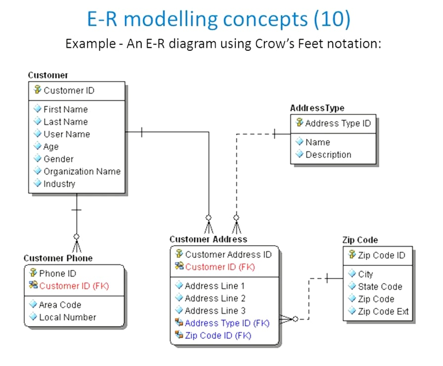
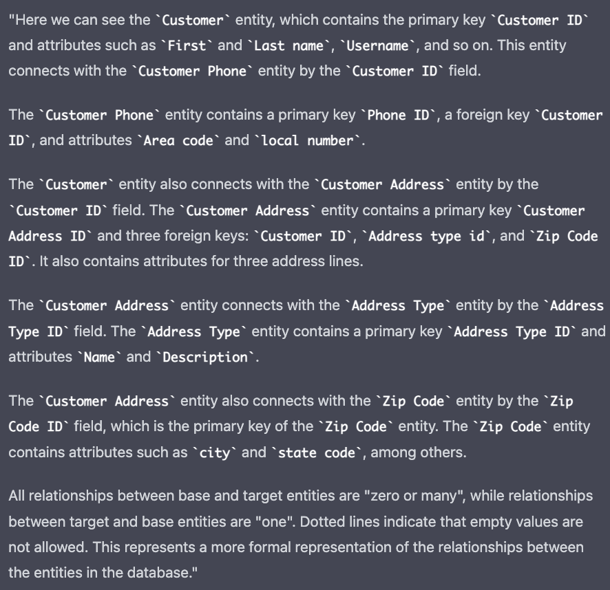

### Technical English V semester

This file will contain solutions to the exercises from the FLTC course.

Some answers were generated by [chat.openai](https://chat.openai.com/chat), a chatbot that uses GPT-3.

#### Exercise 1

You have to write a similar set of instructions on how to communicate with teachers.

There should be from 3 to 5 tips.
Each tip should be formulated in terms of software development.
Then there should be some live examples to make these tips understandable for people who don't know software development
terms.

---

- If you have questions for the teacher, try to represent them clearly and correctly.
  Significantly, the answer to the question is short and meaningful.
  One example of this kind of question is the yes/no question, which only has a binary result.

- Don't make the teacher understand what you mean. Say straight what you want to learn/do.
  For example, instead of saying: "I kind of understood the topic, but not completely, don't take it into your head" -
  say: "I didn't understand the topic, explain something ..., please".

- Explicit is better than implicit.
  In most situations, you are trying to predict the answer to your question.
  Instead of guessing, make a simple question. It will be easier for you both.

#### Exercise 2

The following code computes `a % b`. What is its runtime?

```python
def mod(a: int, b: int) -> int:
    if b <= 0:
        return -1

    div = a // b
    return a - div * b
```

---
The provided code defines a function mod that takes in two integers **a** and **b** as input and returns the remainder
of a divided by **b**. The function first checks if **b** is **less than or equal** to **0**, and if it is, it returns **-1**.

Otherwise, it calculates the quotient of a divided by **b** using the floor division operator (//) and stores it in
the variable **div**.
Finally, it returns the result of **a** minus **div** multiplied by **b**.

In terms of Big-O complexity, this function has a constant time complexity of O(1). This means that the time taken by
the function is independent of the size of the input and is always a fixed amount. The comparison operation (<=) and the
arithmetic operations (//, *, and -) are all constant time operations, so the time complexity of the function is not
affected by the size of a or b.

#### Exercise 3

Pick an algorithm of your choice and record a mp3 or avi file describing its implementation.
Before submitting, listen to your recording, make sure pronunciation is correct (you can with the videos from the
lesson). Submit the version that you are happy about in terms of mistakes and content.

---

Binary search is an efficient algorithm for finding an element in a sorted list or array. It works by dividing the list
into halves and comparing the value being searched for with the middle element. If the value is less than the middle
element, the algorithm searches the left half of the list. If the value is greater than the middle element, the
algorithm searches the right half of the list. This process is repeated until the value is found or it is determined
that the value is not present in the list.

Here is an example of binary search implemented in Python:

```python
def binary_search(list, item):
    low = 0
    high = len(list) - 1

    while low <= high:
        mid = (low + high) // 2
        guess = list[mid]
        if guess == item:
            return mid
        elif guess > item:
            high = mid - 1
        else:
            low = mid + 1
            
    return None    
```

This function takes in a sorted list **list** and an item to search for **item** as input. It initializes two variables,
**low** and
**high**, to the start and end indices of the list. It then enters a loop that continues until **low** is greater than **high**.
Inside the loop, it calculates the middle index of the list by taking the average of **low** and **high** and stores it
in the
variable **mid**. It then compares the element at the middle index with the item being searched for. If they are equal, it
returns the index of the middle element. If the item being searched for is less than the middle element, it updates **high**
to be the index just before the middle element. If the item being searched for is greater than the middle element, it
updates **low** to be the index just after the middle element. If the item is not found after the loop completes, the
function returns **None**.

In terms of Big-O complexity, binary search has a time complexity of O(log n), where n is the size of the list. This
means that the time taken by the algorithm grows logarithmically with the size of the list. Binary search is therefore
much faster than linear search, which has a time complexity of O(n).

#### Exercise 4

Find a data structure related question at Stackoverflow.

Submit:

1. the link to the question

2. the audio file explaining the answers

3. if not all answers are explained, the reference to the answers chosen for explanation

Your explanation should be understandable for a person who is not very knowlegeable in computer science. For example, if you use specific terms, explain or give an example or analogy.

---

A hash table is a data structure that is used to store keys/values in a way that allows for efficient insertion and retrieval.
It does this by using a hash function to map the keys to specific indices in an array, called "buckets," where the values are stored.

To insert a key/value pair into a hash table, the hash function is used to determine the index in the array where the value should be stored.
This index is called the "hash value." The key/value pair is then stored at that index in the array.

To retrieve a value from a hash table, the hash function is used to determine the index in the array where the value is stored.
The value is then retrieved from that index in the array.

One of the main advantages of a hash table is that it allows for efficient insertion and retrieval of values because the hash
function can quickly map keys to the correct indices in the array. This is much faster than searching through an entire array or list to find a particular value.

However, one potential downside of hash tables is the possibility of "collisions," which occur when two or more keys are mapped to the same index in the array.
There are various strategies for handling collisions, such as chaining (storing multiple values at the same index by linking them together in a list) or open addressing (trying to find an alternate index in the array to store the value).

https://stackoverflow.com/questions/730620/how-does-a-hash-table-work

#### Exercise 5

Choose a professional software solution (e.g. editor, compiler, etc.) and record a short presentation on UI for an end-user.

Your presentation should include default settings, at least 3 panels and 1 customization option. 

---

The default user interface of GoLand includes several panels, including:

- The editor panel, which is where you can write and edit your code. By default, the editor panel occupies most of the screen.

- The project panel, which is located on the left side of the screen and allows you to navigate through the packages and files in your project.

- The terminal panel, which is also located on the left side of the screen and allows you to run command-line commands within GoLand.

- The debug panel, which is located at the bottom of the screen and shows the progress of the debugger when you are running and debugging code.

One customization option that is available in GoLand is the ability to change the layout of the panels.
For example, you can move the project panel and terminal panel to the right side of the screen, or you can hide them
altogether if you prefer to have more space for the editor.

You can also customize the appearance of the editor, such as the font size and color scheme, to suit your preferences.

In summary, GoLand provides a user-friendly interface with a variety of panels and customization options to help you
develop software efficiently and effectively.

#### Exercise 6

You need to upload a brushed-up version of your class description of the app.
Your recording should include the information you and your team members presented (information, but not the exact words your team members said), and the answers to the questions your classmates asked. 

---

Have you ever heard about Telegram bot that can help you stay organized and on top of your schedule? It's really cool.
You can create events and receive notifications at regular intervals while the event is still ongoing.

To use the bot, all you have to do is create an event by specifying the event name, date, and time.
You can also specify the notification interval, which is the amount of time between notifications that you want to receive while the event is ongoing.
For example, you might set a notification interval of 15 minutes.

Once you create an event, the bot will store it in its database and send you a confirmation message.
When the event date and time arrives, the bot will send you a notification message reminding you of the event.
The notification will include the event name and time, as well as any other relevant details.

The bot will continue to send you notifications at the specified interval until the event is complete.
You can view, edit, or delete the event at any time using the bot.

In addition to creating and receiving notifications for events, the bot can also do other things
like set reminders and manage your schedule. It's really useful and efficient because it uses modern
programming techniques like concurrency and asynchronous requests.

Overall, this Telegram bot is a great tool for staying organized and remembering important events.
It can help you stay on top of your schedule and avoid missing important appointments or deadlines.
I think it's really helpful, and I'm sure you guys will find it useful too.

So, if you're interested in trying out this Telegram bot, all you have to do is download the app and start creating events.
It's super easy to use, and it's definitely worth checking out if you want to stay organized and on top of your schedule.


#### Exercise 7

Create presentation, that describes some API

---

Presentation creating using [Marp](https://marp.app/) and run of following command:

```bash
marp --pdf --allow-local-files ./docs/api.md --output ./docs/api.pdf
```

You can find the presentation [here](docs/api.pdf).

#### Exercise 8

Presentation of Database solution

---

Let’s find out about entity relationship diagram of this database.




#### Exercise 9

Invent a technical question that could be asked in the Q&A session.
Make sure it doesn't repeat the ones that were asked in the Q&A session video you have watched in class.

Record a short message describing a problem and its potential solutions using the vocabulary from the lesson.

---

In the main part of video guys said that the uses JavaScript for Game Development. Also, they mark, that they have some
problems with the performance of the game. So, I decided to consider the question: "Why they didn't predict the bad performance?"
It's a well-known fact that JavaScript is not the best language for game development. So, I think that they should have known
about it. 

JavaScript is not a common choice for game development, because of:

- Performance: Games require fast, real-time performance, and JavaScript is generally not as fast as native code
(code that is compiled directly for a specific platform, such as C++).
This can make it difficult to achieve the high frame rates and smooth animation that are necessary for a good gaming experience.

- Limited access to hardware: JavaScript is a high-level language that is executed in a virtual machine,
which means it has limited access to hardware resources such as the GPU (graphics processing unit) and other peripherals.
This can make it difficult to build games that make use of advanced graphics or other hardware features.

- Limited support for common game development tools and frameworks: Many of the tools and frameworks that are commonly
used for game development, such as game engines and physics libraries, do not have native support for JavaScript.
This can make it difficult to use these resources when building games with JavaScript.

Despite these challenges, it is still possible to build games with JavaScript,
and there are some frameworks and libraries that can make the process easier.
However, it is generally more common to use languages like C++, C#, or Java for game development.

#### Exercise 10

StackOverflow question

---

Here is mine [interesting question](https://stackoverflow.com/questions/74404104/how-to-handle-linked-models) from StackOverflow.

#### Exercise 11

Cover letter for a job application

---

Here is my [cover letter](docs/cl.pdf) to the TikTok company. 

#### Exercise 12

Pick one of the vacancies. Choose ONE of the job requirements.

Think of how you are going to tell about your experience in this field that would show your teamwork
and problem-solving skills. You need to use STAR framework.

---

I picked the vacancy of a Backend Software Engineer in Slack.
I will tell about my experience in the field of teamwork and problem-solving skills.

##### Situation

I was working on a project to implement a birthday reminder service for a large organization.
The service needed to notify employees and their managers of upcoming birthdays via Asana and Slack.

##### Task

My task was to design and implement the birthday reminder service using Python and integrate it with Asana and Slack.

##### Action

I started by researching the APIs and integration options available for Asana and Slack.
I then used Python to build a script that would retrieve employee birthday data from the organization's database and use the Asana and Slack APIs to send notifications to the appropriate employees and managers. I tested and debugged the script to ensure it was functioning correctly.

##### Result

The birthday reminder service was successfully implemented and has been running smoothly since its launch.
It has been well-received by employees and has helped to improve team morale and communication within the organization.

#### Exercise 13

In Java, what is the difference between `final`, `finally` and `finalize`?

---

In Java, the `final` keyword has several meanings depending on the context in which it is used.

- When used with a variable, `final` means that the value of the variable cannot be changed once it is initialized. For example:
  ```java
  final int x = 10;
  x = 20; // This would cause a compilation error
  ```

- When used with a method, final means that the method cannot be overridden by a subclass. For example:
  ```java
  class A {
    final void foo() { ... }
  }
  
  class B extends A {
    void foo() { ... } // This would cause a compilation error
  }
  ```

- When used with a class, final means that the class cannot be subclassed. For example:
  ```java
  final class A { ... }
  
  class B extends A { ... } // This would cause a compilation error
  ```

The `finally` keyword is used in a `try-catch-finally` block to specify a block of code that should be executed
regardless of whether an exception is thrown or caught. For example:

```java
try {
  // Code that might throw an exception
} catch (Exception e) {
  // Code to handle the exception
} finally {
  // Code that will always be executed
}
```
The `finalize` method is a method that is defined in the `Object` class and is intended to be used as a cleanup method
when an object is garbage collected.

It is generally not recommended to use the `finalize` method in Java, as the garbage collection process
is non-deterministic and cannot be relied upon for resource management.


#### Exercise 14

Record a voice message on how you would test the solution.

---

In my practice, we used a lot of different kinds of testing our solutions, such as Unit, Smoke, integration, regress tests and so on.

Unit tests are written by developers as usual to be sure, and it is first level of tests, when you can test your solution inside the code. Talking to myself, I wrote Unit tests using special Java libraries, Mockito for example.

Regress tests - it’s retesting before deploy in production to make sure that everything is clear and fix found bugs.

Smoke tests - it’s testing after deploy in production. If something went wrong, we must quickly roll back all changes and find problems.

Integration tests are needed when you integrate with other service
