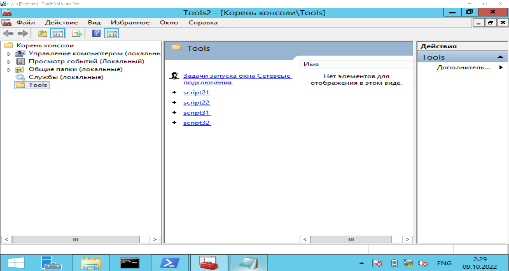

# Администрирование Windows №1

## Финальная версия консоли:



- script21.cmd

```powershell
@echo off
set /p FIO = "Enter username: "
set USERNAME=UPart2%FIO%
set GROUP=GPart2%FIO%
net localgroup %GROUP% /add
echo Group %GROUP% created

net user %USERNAME% created
echo %USERNAME% %GROUP%

net user %USERNAME% /add
net localgroup %GROUP% %USERNAME% /add

net user %USERNAME% /active:yes
echo User %USERNAME% activated
```

- script22.cmd

```powershell
@echo off
set /p Param = "Enter Auto/Manual"
if "%PARAM%" == "Auto" (
	netsh interface ipv4 set dns "Ethernet" dhcp
	netsh interface ipv4 set address "Ethernet" dhcp
)
if "%PARAM%" == "Manual" (
	netsh interface ipv4 set dns name = "Ethernet" static 8.8.8.8
	netsh interface ipv4 set address name = "Ethernet" static 192.168.1.10 255.255.255.0 192.168.1.1
)

```

- script31.ps1

```powershell
$str = Read-host "Enter username"
if ($str -notmatch ^[a-zA-Z]{4}$') {
	echo "Username have to contains 4 symbols"
	exit 1
}
$username = "UPart3" + $str
if (Get-LocalUser | Where-Object Name -eq $username) {
	echo "User $username already exists"
	exit 1
}

New-LocalUser $username -NoPassword

$groupname = "GPart3" + $str

if (Get-LocalGroup | Where-Object Name -eq $groupname) {
	echo "Group $groupname already exists"
	exit 1
}

New-LocalGroup $groupname
echo "Group $groupname successfully created!"

Add-LocalGroupMember -Group $groupname --Member $username

Enable-LocalUser -Name $username
echo "User $username is enabled"
```

- script32.ps1

```powershell
$profile = Read-host "Enter Auto/Manual"

if ($profile -eq "Manual") {
	Remove-NetRoute -InterfaceAlias Ethernet
	New-NetIPAdress -InterfaceAlias Ethernet -IPAdress 192.168.1.10 -PrefilLength 24 -DefaultGateway 192.168.1.1
	Set-DnsClientServerAdress -InterfaceAlias Ethernet -ServerAdresses 8.8.8.8
}
elseif ($profile -eq "Auto") {
	Set-NetIPInterface -InterfaceAlias Ethernet -Dhcp Enabled
	Set-DnsClientServerAddress -InterfaceAlias Ethernet -ResetServerAddresses
}
else{
	echo "Invalid profile"
	exit 1
}
```

**Вопросы:**

1. *В каких группах оказался пользователь после п.6 Части 1?*


1. *Сравните организацию диалога в скриптах CMD и PowerShell. Приведите результаты сравнения.*
   В общем и целом синтаксис и функционал в PowerShell более user-friendly, нежели чем в CMD. Ввод в CMD осуществляется
   с помощью команды **set /p,** в PowerShell **-Read-Host.** Вывод на консоль в целом не отличается.
2. В нашу консоль можно добавить (или настроить существующие) оснастки для управления удаленным компьютером, либо нажав
   правой кнопкой мыши на нужную оснастку и "подключиться к другому компьютеру", где нужно указать IP или имя компьютера
   в одной сети с нашим