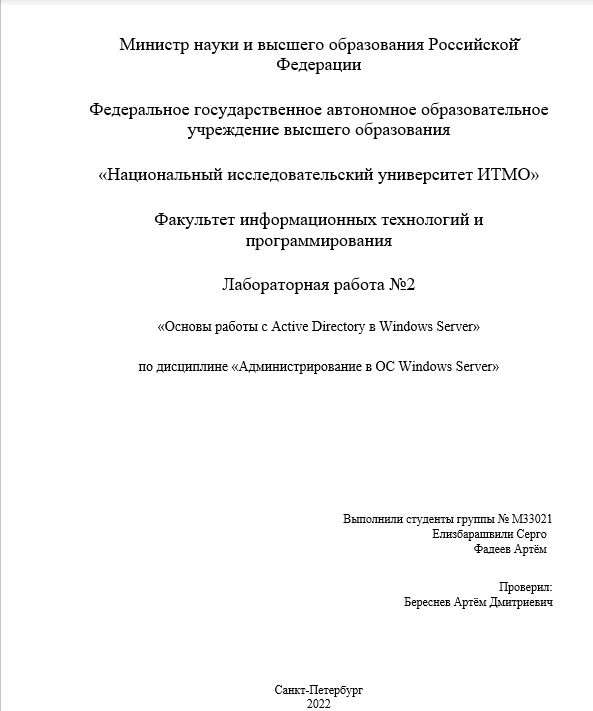

# Администрирование Windows №2

## Артефакты

1. *Приведите скриншоты групповых политик AD из части 4.*

1.  *Приведите скрипт из части 5.*

1. *Как с помощью Powershell восстановить удалённый объект AD?*

1. *Приведите конвейер команд из ч.6 п.3.*

1. *Приведите конвейер команд из ч.6 п.4.*

## Вопросы

1. *Раскройте смысл терминов дерево доменов, лес и схема Active Directory?*
**Лесом** называют полностью самостоятельную организацию Active Directory, которая имеет определённый набор атрибутов и является периметром безопасности организации.

**Дерево доменов -**  коллекция доменов, которая отражает организационную структуру.

**Схема Active Directory -** содержит формальные определения каждого класса объектов, который можно создать в лесу Active Directory.
2. *Где на контроллере домена хранится данные об объектах Active Directory в виде файлов? Какие файлы за что отвечают?*
База данных Active Directory хранится на контроллере домена в файле NTFS.DIT, который находится в папке %SYSTEMROOT%\NTDS.
*Файлы:*
    - ntds.dit - База данных
    - edb.log - журнал транзакций
    - файлы edbxxxxx.log - вспомогательные журналы транзакций
    - edb.chk - файл контрольной точки (checkpoint file) - для протоколирования транзакций для отметки времени внесения обновлений из файлов журналов в базу данных ntds.dit
    - файлы resl.log и res2.log - резервные файлы журнала (защита от переполнения системного раздела)
    - файл temp.edb - временный файл, в котором хранится информация о текущих транзакциях, а также страницы, извлеченные из базы данных ndts.dit во время сжатия
3. *Где на контроллере домена хранятся файлы, содержащие групповые политики домена?*
    
    Расположены по пути ***“C:\Windows\SYSVOL\<domain>\Policies”*** на контроллере домена.
    
4. *Какие компоненты автоматически устанавливаются мастером при добавлении ролей Active Directory?*
Такие компоненты, как ADFS, для которых нужно установить сертификат, или DNS, для которого следует указать полное доменное имя FQDN.
5. *Для чего нужен пароль DSRM?*
Для предотвращения несанкционированного доступа к данным и для входа на контроллер домена, если служба AD DS не запущена или контроллер домена запущен в режиме DSRM.
6. *Как восстановить пароль DSRM, если он был утерян после установки?*
В случае необходимости сброса пароля DSRM необходимо воспользоваться программой обслуживания служб Active Directory ntdsutil.exe из под учетной записи с правами администратора

1. *Зачем нужно имя домена NetBIOS?*
Нужен для обнаружения компьютеров в сети, построенной на базе TCP/IP. Не обязателен — если его отключить, сеть будет работать, но в сетевом окружении пропадет список узлов. Имена в сети NetBIOS имеют ограничение в 15 символов.
2. *Какие группы пользователей создаются в AD автоматически? Опишите минимум 5 из них.*
- ***Администраторы (Administrators*)** — локальная группа, в зависимости от ее расположения предоставляющая полный административный доступ к отдельному компьютеру или конкретному домену. Чтобы назначить кого-то администратором локального компьютера или домена, достаточно включить его в данную группу. Изменять эту учетную запись вправе только члены группы Администраторы (Administrators).
- ***Глобальная группа Администраторы домена (Domain Admins)*** призвана помочь в администрировании всех компьютеров в домене. У этой группы есть административный контроль над всеми компьютерами в домене, поскольку по умолчанию она входит в группу Администраторы (Administrators).
- ***Глобальная группа Администраторы предприятия (Enterprise Admins)*** позволяет администрировать все компьютеры в дереве или лесу. Она имеет административный контроль над всеми компьютерами на предприятии, так как по умолчанию включена в группу Администраторы (Administrators).
- ***Все (Everyone)*** — все интерактивные, сетевые, коммутируемые и прошедшие проверку пользователи. Эта группа предоставляет широкий доступ к системным ресурсам.
- ***Создатель-владелец (Creator Owner)*** — пользователь, создавший данный файл или папку. Применяется для автоматического предоставления разрешений создателю файла или папки.
1. *Какие записи в DNS создаются специально для AD? Перечислите их, укажете их назначение.*
- A - Адресная запись, соответствие между именем и IP-адресом
- CNAME - Каноническое имя для псевдонима (одноуровневая переадресация)
- SRV - Указание на местоположение серверов для сервисов