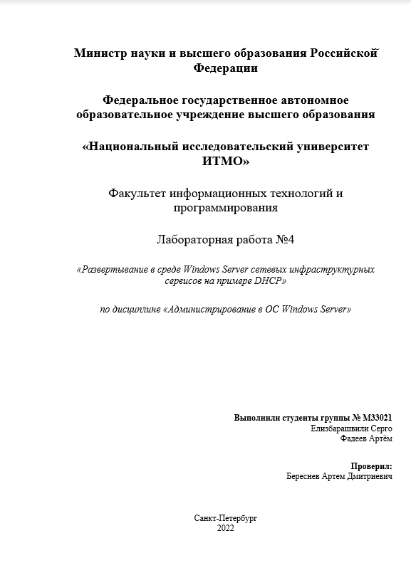

# Администрирование Windows №4



## Артефакты

1. *Приведите секцию добавления области из файла дампа конфигурации из п.8, Часть 2.*


1. *Приведите консольный выводы и скриншоты п. 3, 7, 8, 9 части 3. Дайте пояснения, 
объясните различия.*
    - **Пункт 3**
    
    
    
    - **Пункт 7**
    
    
    
    - **Пункт 8**
    
    
    
    - **Пункт 9**
    
    
    

1. *Приведите консольный выводы и скриншоты п. 7-10 части 4. Дайте пояснения, объясните различия.*


1. *Приведите PS команду экспорта конфигурации DHCP сервера в файл.*

```powershell
netsh dhcp server dump > C:\bak-dhcp\dump.txt
```

1. *Приведите текст скрипта Части 5.*


## Вопросы

1. *Раскройте смысл понятий в контексте DHCP: область, опция, аренда, политика.*
    - **Область** - административная группа, идентифицирующая полные последовательные диапазоны возможных IP-адресов для всех клиентов DHCP в физической подсети.
    - **Опции** - дополнительные параметры настройки клиентов, которые сервер DHCP может назначать при обслуживании арендных договоров клиентов DHCP. Например, IP-адреса маршрутизатора или шлюза по умолчанию, серверов WINS или серверов DNS.
    - **Аренда** - отрезок времени, определяющий период, во время которого клиентский компьютер может использовать назначенный IP-адрес.
    - **Политика** - это правила, которые позволяют назначать IP-адреса и/или опции DHCP для клиентов, которые соответствуют условиям политики.
2. *Какие компоненты устанавливаются мастером при добавлении роли DHCP-сервер?*
    - Средства удаленного администрирования сервера
    - Средства администрирования ролей
    - Средства DHCP-сервера
3. *Какие опции DHCP были задействованы в Части 2 ?*
    - Область
    - Пул адресов
    - Арендованные адреса
    - Резервирование
    - Параметры области
    - Политики
    - Архивация конфигурации
4. *Какие режимы работы с точки зрения обеспечения надежности, существуют для DHCP сервера в Windows Server? Объясните разницу.*

    - **Режим балансировки**
        
        В этом режиме область делится на две части в определенной пропорции и обслуживается обоими серверами одновременно. Запросы распределяются по серверам в этой пропорции и каждый сервер выдает IP-адреса из своей части диапазона. Если же один из серверов перестает отвечать, то второй забирает всю область и продолжает обслуживать как своих клиентов, так и клиентов партнера.
        
    - **Режим горячей замены**
        
        В таком режиме область обслуживается одним сервером (основным). Основной сервер отвечает на все запросы клиентов, резервный в нормальном состоянии не отвечает вообще. Только когда основной сервер становится недоступным, резервный переходит в состояние потери партнера и начинает отвечать на запросы клиентов. Когда основной сервер возвращается в строй, резервный переходит в режим ожидания и перестает обслуживать клиентов.
        
5. *Поясните параметры Максимальное время упреждения для клиента (Maximum Client Lead Time) и Интервал переключения состояния (State Switchover Interval). Что они означают? Что произойдет при сбое партнёра если не задавать Интервал переключения состояния?*

    - Максимальное время упреждения для клиента (Maximum Client Lead Time) - время на которое сервер-партнер продлевает аренду адресов клиентам второго сервера, если связь с ним потеряна.
    - Интервал переключения состояния (State Switchover Interval) - время, после потери связи с партнером, когда сервер перейдет из состояния "связь потеряна" в состояние "партнер отключен"
    
    Если Интервал переключения состояния не задан, то администратор должен вручную перевести статус DHCP-сервера в состояние “партнер отключен” с помощью консоли управления DHCP или PowerShell.
    
6. *Что из себя представляет архивная копия DHCP-сервера?*
    
    При выполнении синхронной или асинхронной архивации сохраняется вся база данных DHCP, включая следующие сведения:
    
    - Все области, включая суперобласти и области многоадресной рассылки.
    - Резервирования.
    - Выделения.
    - Все параметры, включая параметры сервера, области резервирования и классов.
    - Все разделы реестра и другие параметры конфигурации (например, параметры журнала аудита и размещения папки), заданные в свойствах DHCP-сервера. Эти параметры хранятся в подразделе реестра: ***HKEY_LOCAL_MACHINE\SYSTEM\CurrentControlSet\Services\DHCPServer\Parameters***
    
    Учетные данные динамического обновления DNS (имя пользователя, домен и пароль), используемые DHCP-сервером при регистрации клиентских компьютеров DHCP в DNS, не архивируются ни одним методом архивации.
    
7. *Как переименовать хост с помощью PowerShell?*

