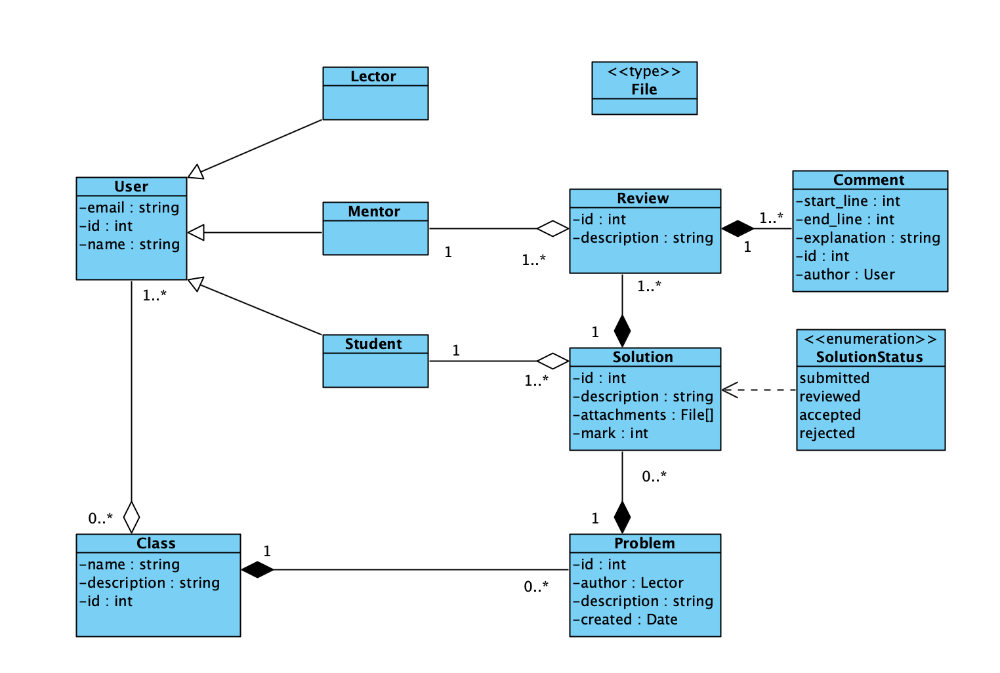
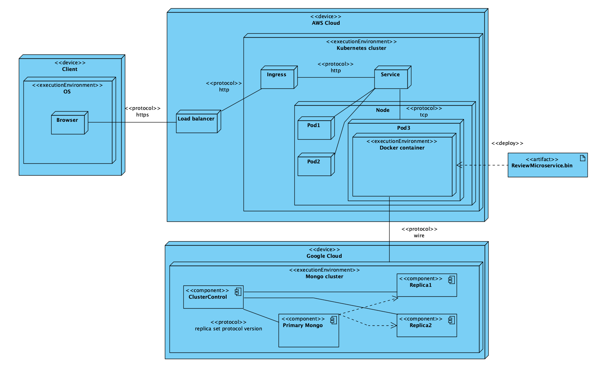

# Моделирование структуры

## Словарь предметной области

- **Задача (problem)** - текстовое описание какой-то проблемы, которую необходимо решить
решить с помощью написания кода
- **Решение (solution)** - текстовое описание, которое показывает как "верно"
можно выполнить задачу
- **Файл (file)** - файл, который может быть прикреплен к решению
- **Статус решения (solution status)** - статус решения, который может быть одним из
следующих: `submitted`, `reviewed`, `accepted`, `rejected`
- **Комментарий (comment)** - текстовое описание, которое отмечает неверный 
фрагмент решения с описанием ошибки
- **Ревью (review)** - множество комментариев, которые относятся к одному решению
+ влияние на статус решения и оценку
- **Ментор (mentor)** - пользователь, который может оставлять комментарии к решениям
- **Студент (student)** - пользователь, который может отправлять решения задач
- **Лектор (lecturer)** - пользователь, который может создавать задачи
- **Класс (class)** - сущность, которая объединяет пользователей в смысловую группу

## Описание проекта 

Вебсайт предоставляет возможность публикации задач, которые могут быть решены
студентами. 

Студентов можно выделять в смысловые группы, в системе называется классами,
которые позволяют абстрагировать пользователей друг от друга.

Каждый пользователь может быть либо студентом, либо ментором, либо лектором.
Лектор - это пользователь, который создал класс и пригласил в него студентов, а
также назначил менторов. Именно лектор может создавать задачи, которые будут
отображаться студентам и проверяться на соответствие решениям менторами.

Студентам предоставляется доступ к новому заданию, когда оно создано лектором.
При наличии решения студент может отправить его на проверку.

Менторы могут оставлять комментарии к решениям студентов, а также выставлять 
оценку, при этом система автоматически меняет статус решения.

Система позволяет просматривать статистику по решениям задач, а также по
классам.

## Диаграмма классов

## Диаграмма размещения

