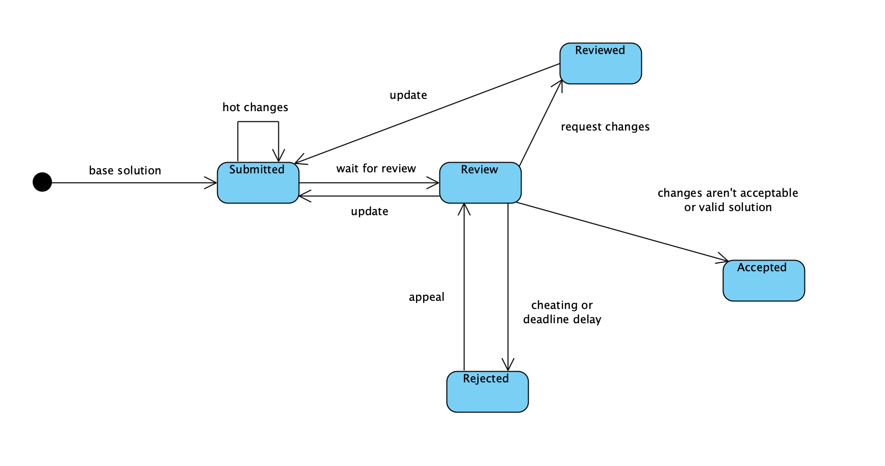
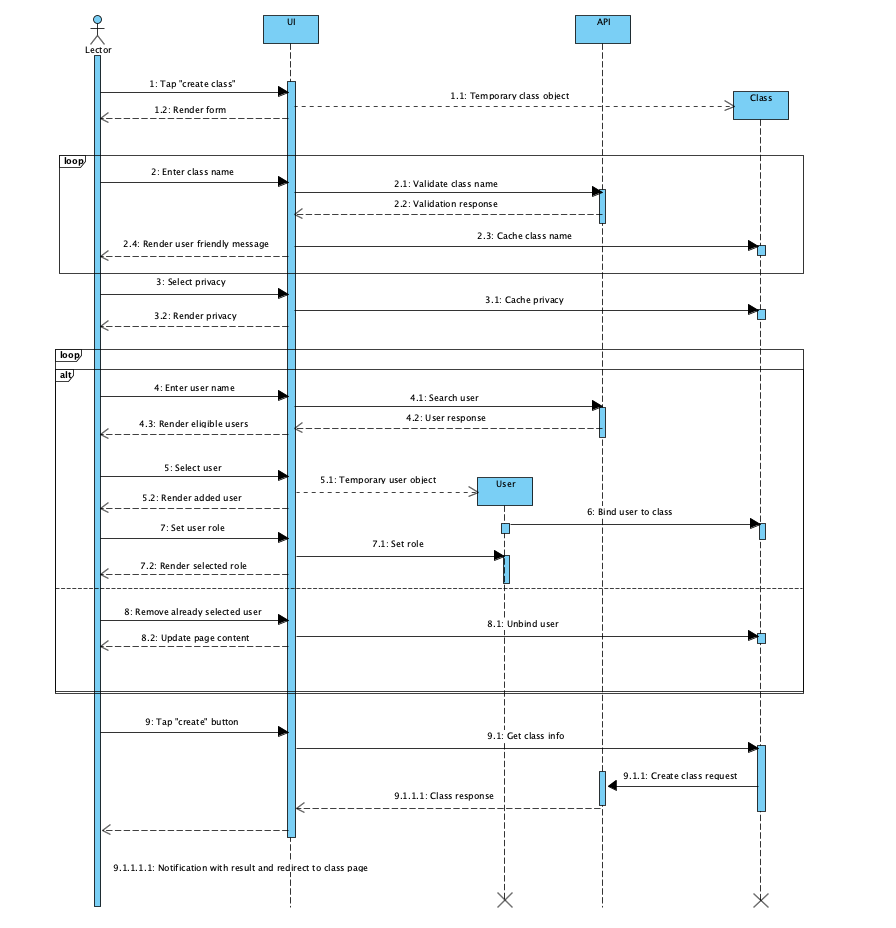
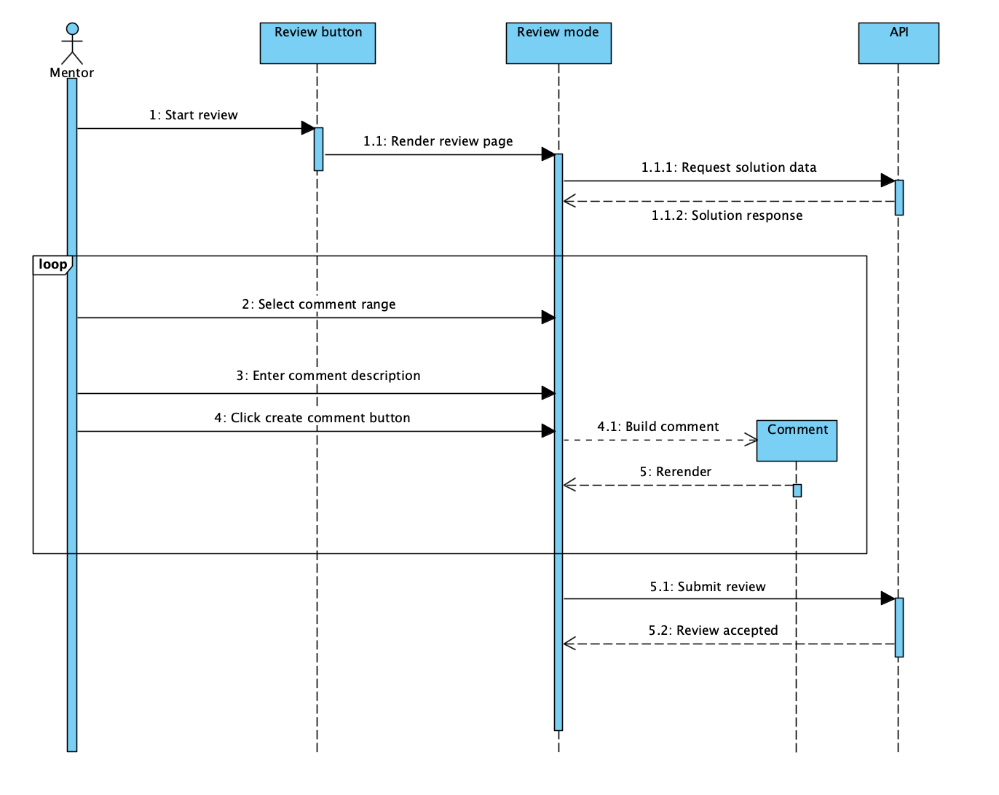
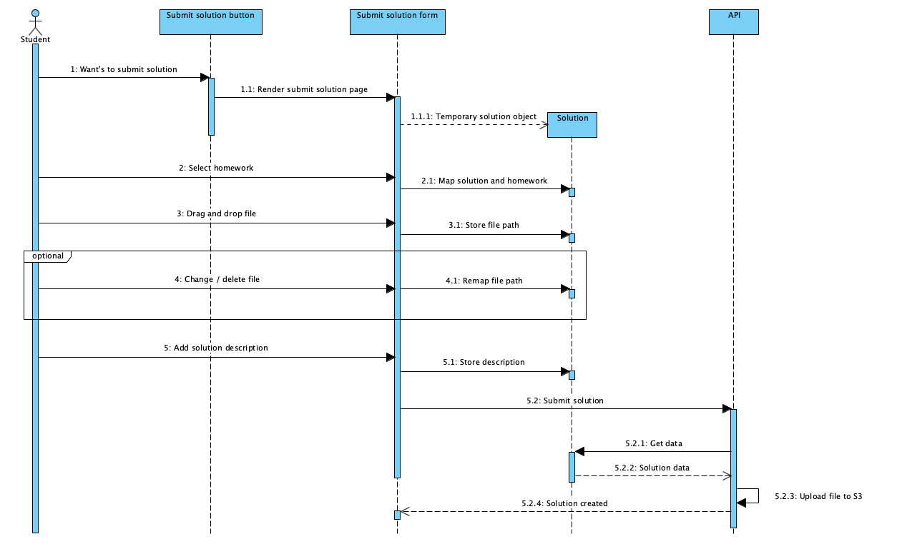

# Моделирование поведения

## Диаграмма состояний

Ниже представлена диаграмма состояний для `Solution`:

## Диаграммы последовательности

### Создание класса

### Процесс ревью

### Отправка решения

