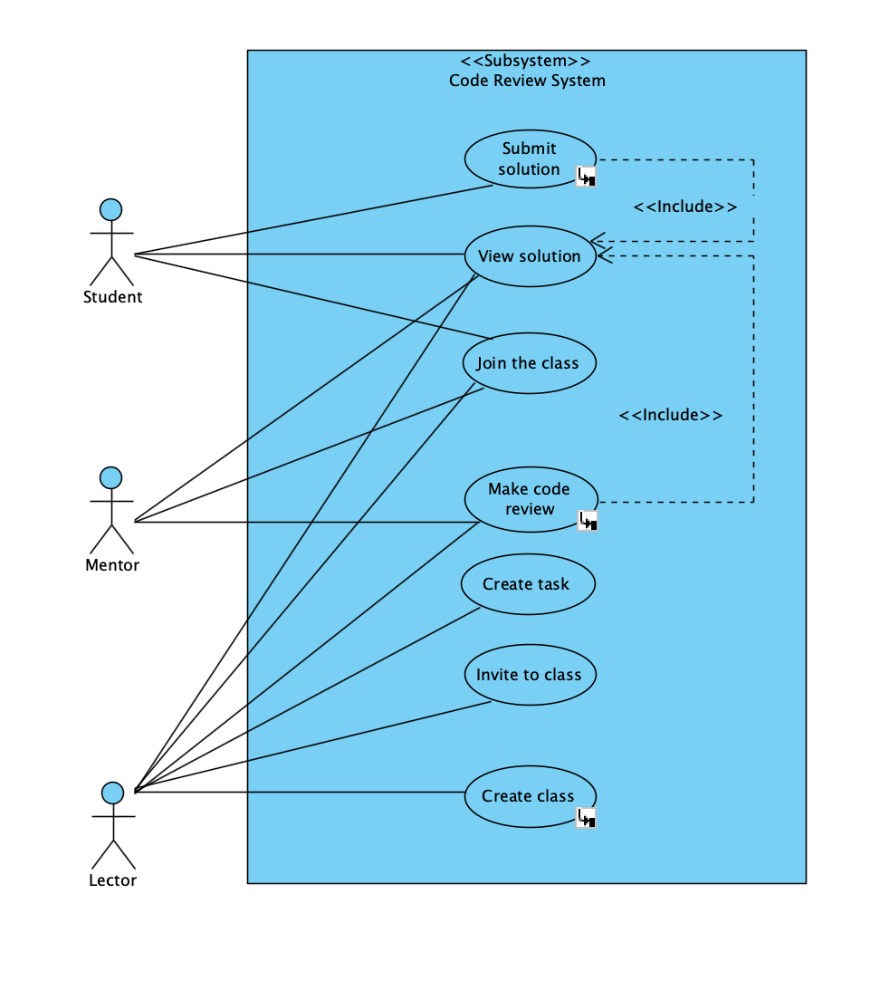
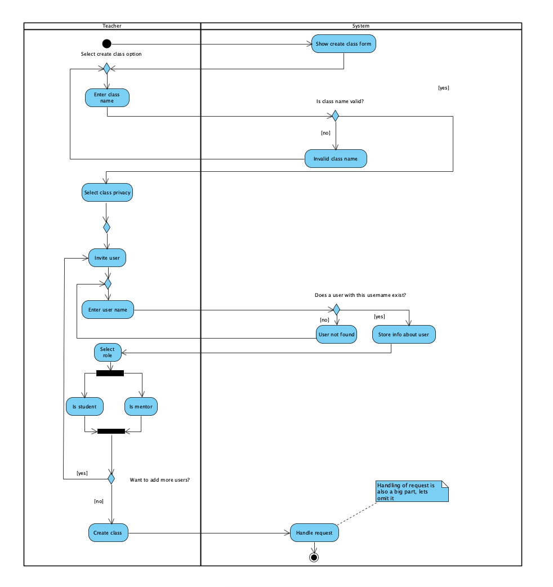
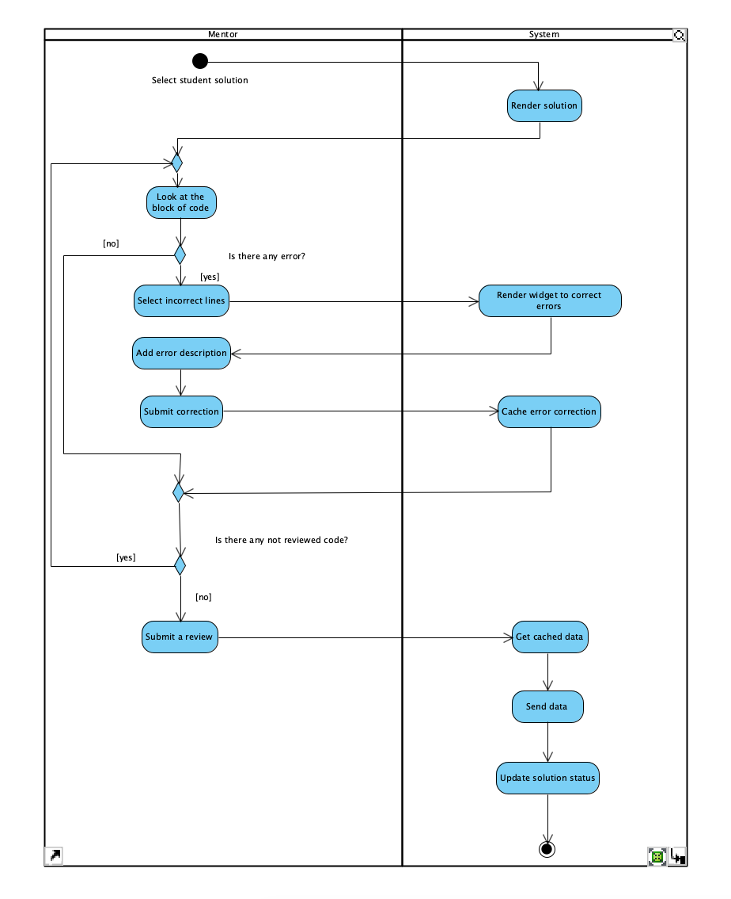
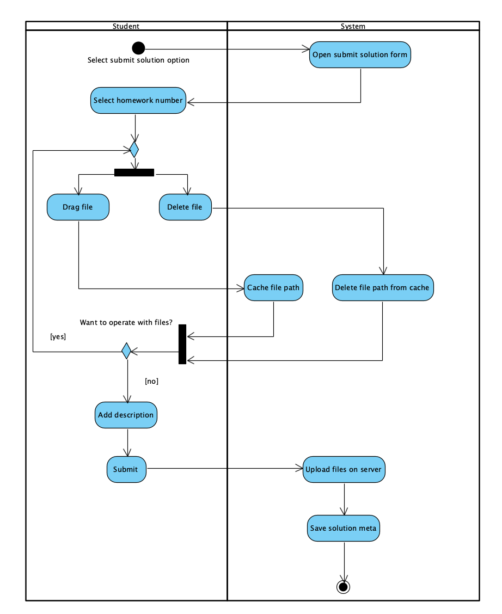

# Моделирование использования

## Обзор и анализ предметной области

Важным аспектом в обучении программированию является корректность написанного кода.

Что же такое корректный код?

Корректный код — это код, который отрабатывает предсказуемо, не содержит грубых ошибок.

Для проверки кода существуют как минимум два подхода:

- **автоматический**, когда код проверяется с помощью специальных программ (линтеров)
- **ручной**, когда код проверяется человеком

Первый подход позволяет быстро проверить код на наличие ошибок, но его область применения
ограничена.

Второй в свою очередь позволяет найти более глубокие ошибки, но требует больше времени и внимания
от человека, а также возникает необходимость в системах, которые позволяют производить проверку.

Именно в проектировании и создании такой системы и заключается наша задача.

## Объект автоматизации

В данном случае объектом автоматизации является процесс проверки кода
на корректность.

Без такой системы процесс проверки кода обычно выполняется вручную,
включая использование бумажных или электронных документов для проверки
кода и предоставление обратной связи через отдельный канал связи,
такой как электронная почта.

Этот процесс может занимать много времени, подвержен ошибкам и может
привести к более медленным циклам обратной связи.

Благодаря внедрению автоматизированной системы проверки кода процесс
становится более эффективным и результативным.

Система предоставляет интерфейс, который позволяет добавлять комментарии
или аннотации непосредственно в код, выделяя проблемы и предлагая изменения
в режиме реального времени.
Это может улучшить взаимодействие между ревьюером и разработчиком,
что приведет к сокращению времени обработки и уменьшению недопонимания.

## Аналоги

Существует множество платформ, которые позволяют проверять код на корректность.

Возьмем двух гигантов этой области:

- **GitHub**

> На GitHub инструменты проверки кода встроены в пулл-реквесты.
> Вы можете запрашивать обзоры, предлагать изменения, чтобы улучшить качество вашего кода.

- **GitLab**

> GitLab позволяет просматривать код, обсуждать изменения, делиться знаниями,
> и выявлять дефекты в коде с помощью асинхронного просмотра и комментирования.
> GitLab может автоматизировать, отслеживать и сообщать о проверках кода.

## Основные действующие лица. 

Не рассматриваем системы авторизации и аутентификации
тк они работают одинаково независимо от выбранного сервиса и не являются
чем-то уникальным для системы.

- **Студент**: лицо, которое отправляет решение домашней работы для проверки
- **Ментор**: лицо, которое проверяет решение и выставляют оценку
- **Лектор**: лицо, которое создает задание и публикует его, а также публикует
материал лекции

## Основные функциональные требования.

- **Создание задания**: Система должна позволять учителям создавать задания и 
добавлять материал, который может пригодиться при решении
- **Публикация решений**: Система должна позволять студентам публиковать
решения заданий.
- **Просмотр решений**: Система должна позволять авторам работ и их менторам 
просматривать полученные решения.
- **Редактирование решений**: Система должна позволять пользователю редактировать его
отправленное решение и показывать, что изменение было произведено.
- **Код-ревью**: Система должна позволять менторам  проверять работы студентов и
указывать на неверные части решения.
- **Выставление оценки**: Система должна позволять менторам выставлять
оценки студентам за решение задачи.
- **Приватность решений**: Система должна позволять пользователям скрывать
решения от других пользователей.
- **Создание классов**: Система должна позволять пользователям создавать
классы, в которые можно добавлять пользователей, где будет происходить все 
последующее общение.
- **Приглашение в класс**: Система должна позволять пользователям приглашать
других пользователей в свой класс.
- **Принятие приглашения в класс**: Система должна позволять пользователям
принимать приглашения в классы от других пользователей.
- **Обновлять статус решения**: Система должна автоматически обновлять статус
решения, когда ментор выставляет оценку.

## Диаграмма вариантов использования.

## Выбор основных вариантов использования.

- **Создание класса**.
- **Код-ревью**.
- **Публикация решения**.

## Основные нефункциональные требования.

- **Поддержка разных браузеров и устройств**: Система должна поддерживать
разные браузеры и устройства.
- **Удобство использования**: Система должна быть интуитивно понятной и
простой, чтобы пользователи могли быстро освоить ее функционал и использовать
без особых проблем.
- **Безопасность**: Система должна обеспечивать безопасность данных пользователей
и предотвращать их утечку.
- **Скорость и производительность**: Система должна обеспечивать быструю
и эффективную нагрузку, чтобы пользователи могли быстро получать доступ к
необходимой информации.
- **Локализация**: Система должна поддерживать разные языки, чтобы пользователи
могли выбрать язык интерфейса, который им удобнее использовать.

## Диаграммы деятельности для выбранных вариантов использования.

