# Администрирование Windows №3

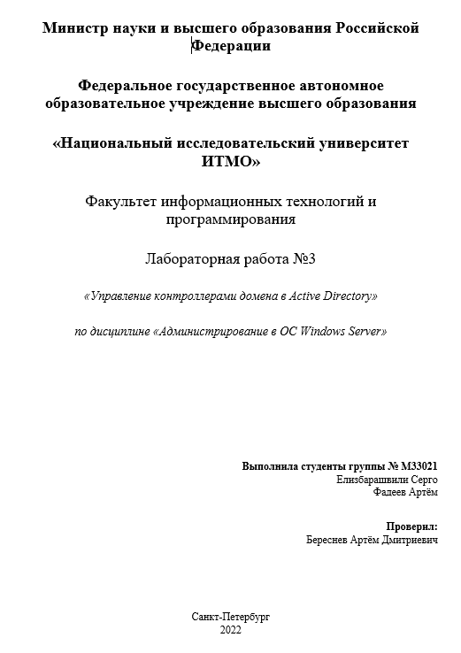

## Артефакты

1. Консольные выводы по Части 3, п. 1-2

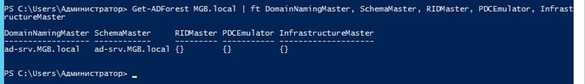

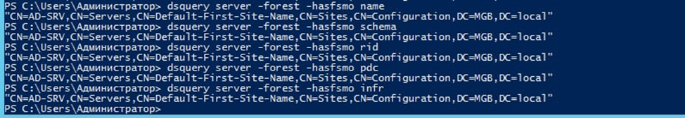

1. Ответ на вопрос из Части 3., п. 3

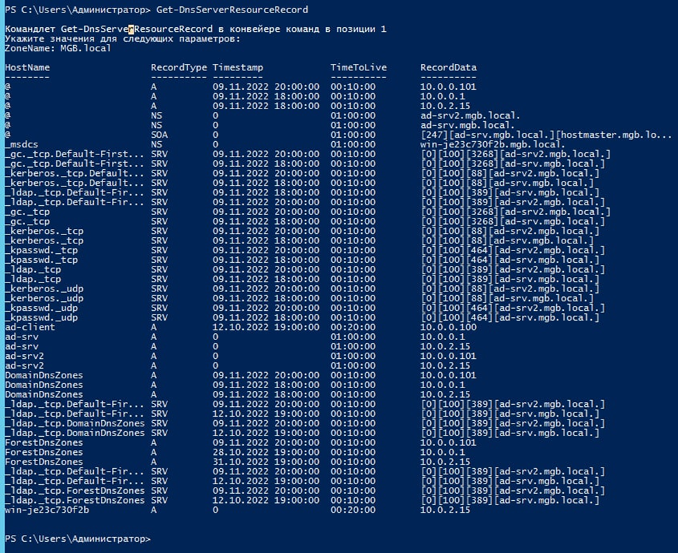

1. Командные строки из Части 4, п 1-2.

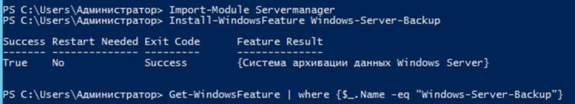

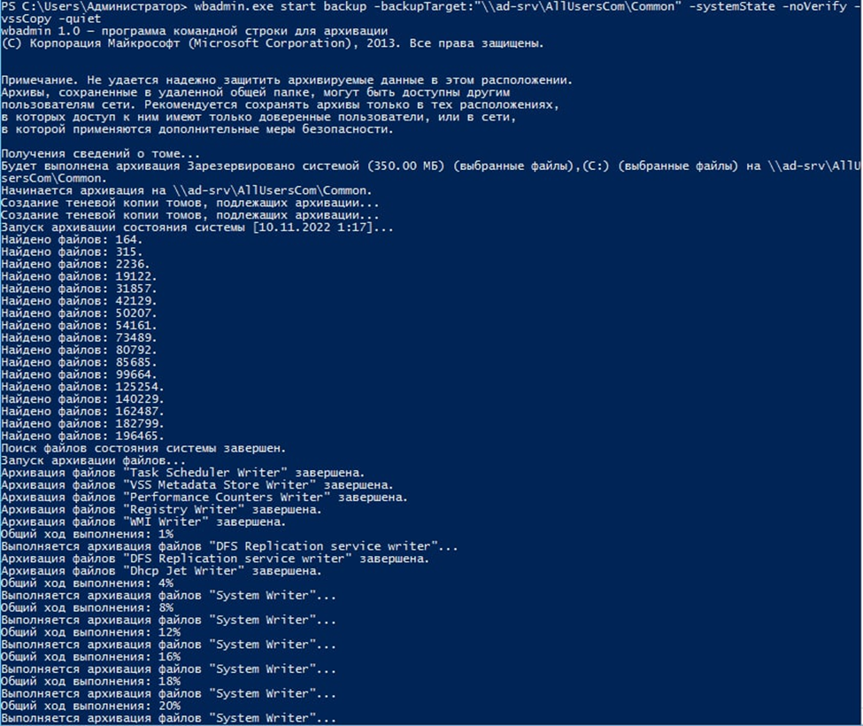

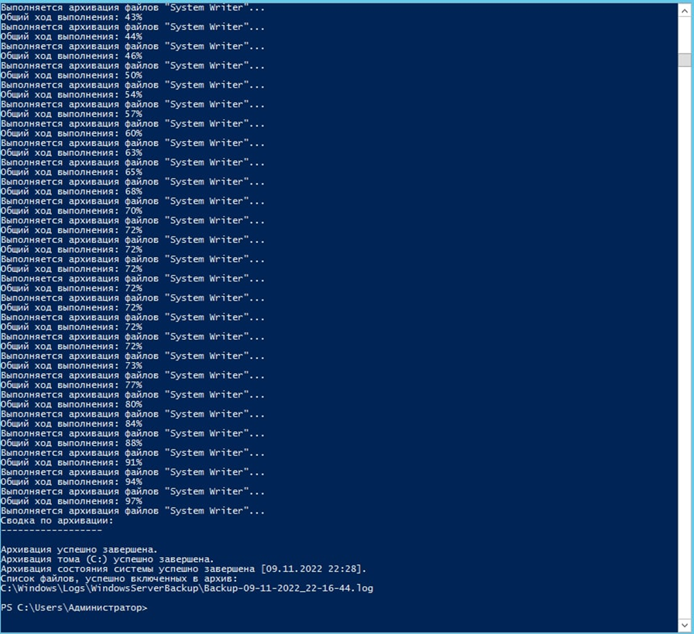

1. Приведите описание процесса переноса ролей из части 5, п. 2, 5


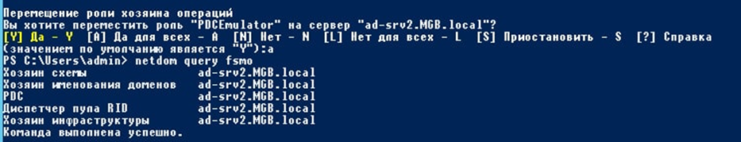

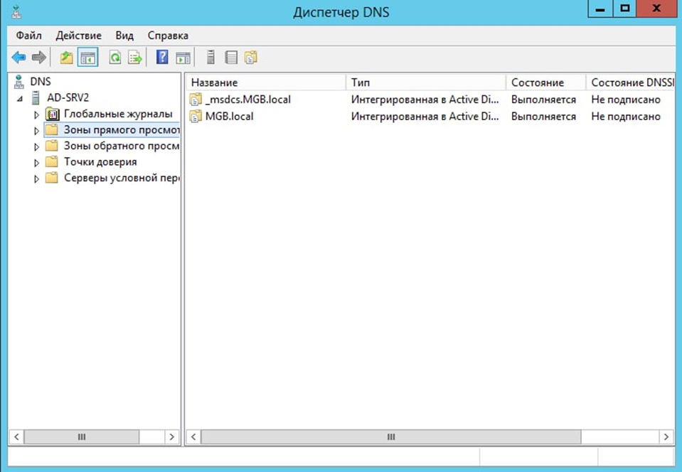

## Вопросы

1. *Перечислите FSMO. Кратко раскройте их назначение*
    - Хозяин схемы - роль необходима для расширения схемы лесы AD
    - Хозяин именования доменов - обеспечивает уникальность имен для создаваемых доменов и разделов приложений в лесу
    - Хозяин идентификаторов - раздает другим контроллерам домена пачки по 500 заготовок для создания уникальных SID
    - Эмулятор PDC - работает как основной обозреватель сети Windows. Отслеживает блокировки пользователей при ошибках паролей. Является  эталоном времени для домена
    - Хозяин инфраструктуры - Для пользователей других доменов, которые являются членами локальных групп своего домена создает и обновляет специальные объекты в базе глобального каталога своего домена
2. *Опишите, что произойдет, если не будет доступна каждая из ролей.*
    
    **Недоступен Schema master (Мастер схемы)**
    
    Если владелец роли Schema master оказался недоступен, то на работу службы каталогов это не окажет никакого влияния, до того момента пока не будет необходимости внести изменения в схему Active Directory.
    
    **Недоступен Domain naming master (Мастер именования домена)**
    
    Если владелец роли Domain naming master оказался недоступен, то до того момента, пока не потребуется добавить дополнительный домен в лес или удалить один из доменов из леса, наличие этой роли не будет играть никакой роли в жизни домена.
    
    **Недоступен RID master (Мастер относительных идентификаторов)**
    
    Если владелец роли RID master стал недоступен, то это может оказать влияние на работу домена в том случае, если в домене регулярно создаются новые объекты. По окончании ранее выданного пула RID (RID выдает пул 500 номеров на каждый контроллер домена), контроллер домена не сможет создать новый объект. Если у вас небольшая организация, с небольшим объемом новых объектов AD, то можете сами оценить, когда будет нужен владелец роли RID для выдачи нового пула.
    
    **Недоступен PDC emulator (Эмулятор PDC)**
    
    Если владелец роли PDC emulator стал недоступен, то это может негативно отразиться на синхронизации времени в домене, а также на работе некоторых служб, использующих PDC в качестве источника хранения конфигурации, например, DFS.
    
    **Недоступен Infrastructure master (Мастер инфраструктуры)**
    
    Если владелец роли Infrastructure master стал недоступен, то в случае однодоменной структуры AD это никак не отразится на работе службы каталогов. Если же лес AD состоит из нескольких доменов, то могут возникнуть проблемы в работе системам, которые используют объекты из разных доменов.
    
3. *Как с помощью утилиты dcdiag проверить корректность настройки только dns?*

```powershell
Dcdiag /test:dns
```

1. *Как с помощью утилиты dcdiag исправить ошибки в конфигурации?*

```powershell
Dcdiag /fix
```

1. *Как ввести компьютер в домен с помощью утилиты netdom?*

```powershell
netdom join %computername% /domain:domain.ru /userd:DOMAIN\administrator /passwordd:password
```

1. *Как ввести компьютер в домен с помощью утилиты PowerShell?*

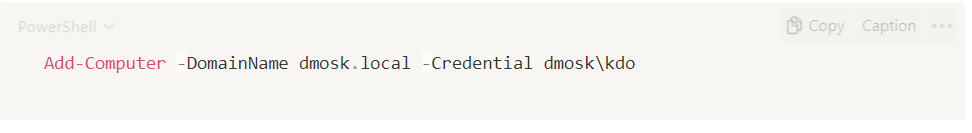

1. *Как запустить процесс от имени другого пользователя с помощью утилиты runas?*

```powershell
runas /user:administrator “<путь до процесса>”
```

1. *Как запустить процесс от имени другого пользователя с помощью командлета Invoke-Command?*

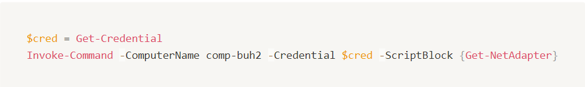